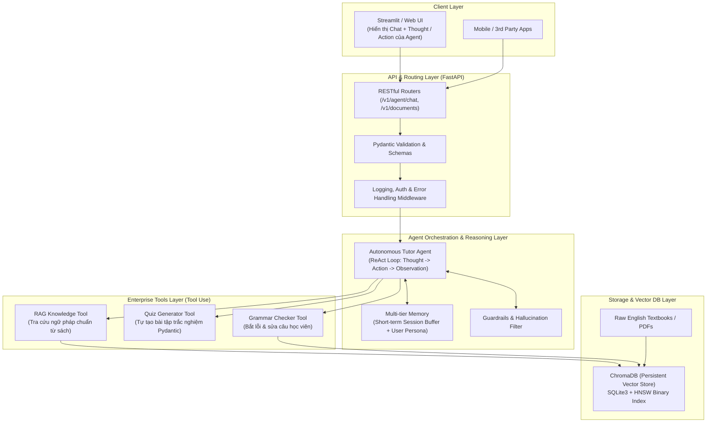

# LỘ TRÌNH DỰ ÁN: ENTERPRISE AGENTIC RAG & AI ENGLISH TUTOR (14 NGÀY - 1 GIỜ/NGÀY)

> **Mục tiêu**: Xây dựng hệ thống **Gia Sư Tiếng Anh Tự Trị (Autonomous AI English Tutor Agent)** kết hợp **Agentic RAG** theo **Tiêu chuẩn Kỹ thuật Doanh nghiệp (Enterprise Production-Grade)**: Clean Architecture, FastAPI Backend, ReAct Agent Loop, Vector Database, Multi-tier Memory, Structured Logging, Pydantic Type-Safety và Dockerization.

---

## 🎯 1. Kiến trúc tổng thể hệ thống (System Architecture)

---

## 🔄 2. Quy trình làm việc hàng ngày (Daily Workflow)
1. **Check-in & Đọc tài liệu (10-15 phút)**: Tóm tắt lý thuyết, design patterns, kiến trúc cần áp dụng.
2. **Q&A Kỹ thuật**: Thảo luận về kiến trúc, cấu trúc dữ liệu, thuật toán và thư viện.
3. **Thực chiến 1 giờ**: Tự tay code các module theo chuẩn Clean Code, Type Hinting và Logging.
4. **Review & Lưu tài liệu**: Ghi chú kiến thức vào `docs/DAY_XX.md`.

---

## 📅 3. Chi tiết lộ trình 14 ngày (Chuẩn Doanh Nghiệp)

### 🔰 GIAI ĐOẠN 1: CORE RAG ENGINE & TẠO DỰNG BỘ NÃO AGENT (TUẦN 1)

#### ✅ **Ngày 1: Thiết lập môi trường, Config Pydantic & Kết nối AI API**
- **Lý thuyết**: Cấu trúc project chuẩn công ty, cơ chế Text Embedding & LLM, bảo mật `.env`.
- **Nhiệm vụ**: Cấu hình môi trường (`conda`/`venv`), viết script test LLM và Embedding.
- **Output**: File `test/test_api.py` và tài liệu [docs/DAY_01.md](file:///c:/Users/Nguyen%20Duc%20Vu%20Bao/Desktop/RAG/docs/DAY_01.md).

#### ✅ **Ngày 2: Document Ingestion Service & Text Cleaning chuẩn ngữ liệu**
- **Lý thuyết**: Xử lý PDF văn bản (`pypdf`), quy tắc làm sạch dữ liệu sách tiếng Anh.
- **Nhiệm vụ**: Xây dựng `DocumentService` đọc PDF, chuẩn hóa chuỗi và trích xuất Metadata.
- **Output**: Module `src/services/document_service.py` và tài liệu [docs/DAY_02.md](file:///c:/Users/Nguyen%20Duc%20Vu%20Bao/Desktop/RAG/docs/DAY_02.md).

#### ✅ **Ngày 3: Chunking Service theo ngữ cảnh học tiếng Anh (Strategy Pattern)**
- **Lý thuyết**: Semantic & Recursive Chunking, giữ trọn Quy tắc ngữ pháp + Ví dụ, xử lý rách từ trong Overlap.
- **Nhiệm vụ**: Viết `ChunkingService` chia nhỏ văn bản có overlap, gắn metadata truy vết.
- **Output**: Module `src/services/chunker_service.py` và tài liệu [docs/DAY_03.md](file:///c:/Users/Nguyen%20Duc%20Vu%20Bao/Desktop/RAG/docs/DAY_03.md).

#### ✅ **Ngày 4: Bản chất Vector Similarity & Toán học trong AI Search**
- **Lý thuyết**: Semantic Vector Space, Cosine Similarity, ma trận hóa tìm kiếm bằng NumPy, Singleton Pattern.
- **Nhiệm vụ**: Tự viết thuật toán tìm kiếm vector thuần bằng NumPy và Singleton `EmbeddingService`.
- **Output**: Module `src/services/embedding_service.py`, `test/test_similarity.py` và tài liệu [docs/DAY_04.md](file:///c:/Users/Nguyen%20Duc%20Vu%20Bao/Desktop/RAG/docs/DAY_04.md).

#### ✅ **Ngày 5: Vector Store Repository (Tích hợp ChromaDB)**
- **Lý thuyết**: Repository Pattern, Kiến trúc lai (SQLite3 + HNSW Binary Index), lưu trữ bền vững (Persistence).
- **Nhiệm vụ**: Xây dựng `ChromaVectorStore` hỗ trợ Ingestion, Count, Reset và Query Top-k kèm lọc metadata.
- **Output**: Module `src/vector_store/base.py`, `src/vector_store/chroma_store.py`, `test/test_chroma_store.py` và tài liệu [docs/DAY_05.md](file:///c:/Users/Nguyen%20Duc%20Vu%20Bao/Desktop/RAG/docs/DAY_05.md).

#### 🎯 **Ngày 6: Xây dựng Core RAG Engine & Grounded Prompting (Facade Pattern)**
- **Lý thuyết**: Kỹ thuật Grounded Prompting chống ảo giác (Hallucination), cấu trúc System Prompt định hình Gia sư Tiếng Anh song ngữ, Facade Pattern che giấu độ phức tạp.
- **Nhiệm vụ**: Nối luồng hoàn chỉnh: `User Query` $\rightarrow$ `Retrieve Top-k từ ChromaDB` $\rightarrow$ `Format Prompt` $\rightarrow$ `Gemini LLM Response`. Chuẩn bị sẵn giao diện để đóng gói thành Tool.
- **Output**: Module `src/services/rag_service.py` và kịch bản test độc lập.

#### 🚀 **Ngày 7: Chuyển đổi RAG sang Tool & Xây dựng Autonomous ReAct Tutor Agent**
- **Lý thuyết**: Cơ chế ReAct (Reason + Act: Thought $\rightarrow$ Action $\rightarrow$ Observation), Function Calling / Tool Contract, Intent Routing (phân loại câu chào, câu hỏi ngữ pháp, yêu cầu bài tập).
- **Nhiệm vụ**: 
  - Đóng gói `RAGService` thành `GrammarRetrievalTool`.
  - Xây dựng `TutorAgent` tự động suy luận: Khi nào cần tra sách, khi nào chào hỏi thân thiện.
  - Xây dựng giao diện CLI tương tác trò chuyện trực tiếp với Agent.
- **🎯 Milestone 1**: Core AI Tutor Agent CLI Engine chạy độc lập, tự chủ suy luận và tra cứu nguồn gốc chính xác.

---

### 🚀 GIAI ĐOẠN 2: FASTAPI BACKEND, MULTI-TOOL AGENT & STREAMLIT UI (TUẦN 2)

#### **Ngày 8: Xây dựng RESTful API Backend với FastAPI cho AI Agent**
- **Lý thuyết**: Kiến trúc Web API chuẩn Enterprise, Pydantic Request/Response DTOs, Dependency Injection, Swagger Documentation (`/docs`).
- **Nhiệm vụ**: Xây dựng các endpoints: `POST /api/v1/agent/chat`, `POST /api/v1/documents/upload`, `GET /health`.
- **Output**: Server FastAPI chạy tại `http://localhost:8000`.

#### **Ngày 9: Streaming Server-Sent Events (SSE) & Trí nhớ Hội thoại Đa tầng (Memory)**
- **Lý thuyết**: Streaming SSE trả về từng từ và hiển thị Thought Process của Agent; Short-term Memory (Chat History Window Buffer) xử lý câu hỏi nối tiếp.
- **Nhiệm vụ**: Nâng cấp API endpoint hỗ trợ Streaming và lưu trữ lịch sử hội thoại nhiều lượt.
- **Output**: Endpoint `POST /api/v1/agent/chat/stream`.

#### **Ngày 10: Mở rộng Tool 1: Autonomous Quiz & Exercise Generator Tool**
- **Lý thuyết**: Structured Outputs (JSON Schema / Pydantic) ép LLM trả về cấu trúc trắc nghiệm chuẩn xác 100%, tích hợp Tool vào Agent.
- **Nhiệm vụ**: Xây dựng `QuizGeneratorTool` cho phép Agent tự động tạo 3 câu trắc nghiệm kiểm tra học viên dựa trên bài học trong sách.
- **Output**: Tool `src/tools/quiz_tool.py` và endpoint `POST /api/v1/agent/quiz`.

#### **Ngày 11: Mở rộng Tool 2: "Check My English" & Multi-step Error Correction Tool**
- **Lý thuyết**: Error Analysis Prompting, quy trình Agent đa bước: Phân tích câu sai $\rightarrow$ Gọi RAG tra cứu quy tắc $\rightarrow$ Trích dẫn giải thích $\rightarrow$ Gợi ý sửa đổi.
- **Nhiệm vụ**: Xây dựng `GrammarCheckerTool` phát hiện lỗi sai câu học viên viết và đối chiếu chính xác với sách.
- **Output**: Tool `src/tools/grammar_checker_tool.py` và endpoint `POST /api/v1/agent/check-grammar`.

#### **Ngày 12: Dựng Giao diện Web UI hiện đại với Streamlit**
- **Lý thuyết**: Kết nối Frontend với FastAPI Backend, thiết kế giao diện Chat phong cách ChatGPT, hiển thị hộp suy luận của Agent (Collapsible Expander: Agent Thought & Tool Usage).
- **Nhiệm vụ**: Xây dựng Web App tương tác đầy đủ: Chatbot gia sư, Tự động mở sách trích dẫn, Làm Quiz trắc nghiệm.
- **Output**: Giao diện Web chạy tại `http://localhost:8501`.

#### **Ngày 13: Đánh giá Chất lượng Agent & RAG (RAG Triad + Tool Accuracy)**
- **Lý thuyết**: Bộ 3 tiêu chí RAG Triad (Context Relevance, Groundedness, Answer Relevance) kết hợp đánh giá độ chính xác khi chọn Tool của Agent (Tool Selection Accuracy).
- **Nhiệm vụ**: Chạy bộ benchmark 10 câu hỏi thực tế, đánh giá điểm số và tối ưu prompt/retrieval.
- **Output**: Báo cáo đánh giá chất lượng `docs/evaluation_report.md`.

#### **Ngày 14: Đóng gói Docker, Docker Compose & Hoàn thiện Enterprise Portfolio**
- **Lý thuyết**: Containerization với Docker đa tầng (Multi-stage build), Docker Compose khởi chạy toàn bộ hệ sinh thái chỉ với 1 lệnh duy nhất.
- **Nhiệm vụ**:
  - Viết `Dockerfile` và `docker-compose.yml` (Backend FastAPI + Frontend Streamlit + ChromaDB Volume).
  - Viết `README.md` đẳng cấp với sơ đồ kiến trúc Mermaid, demo GIF và hướng dẫn cài đặt 1 chạm.
- **🎯 Milestone 2**: Dự án Enterprise AI Tutor Agent hoàn chỉnh 100%, sẵn sàng đưa lên GitHub và CV xin việc ở các vị trí AI/LLM Engineer cao cấp.
