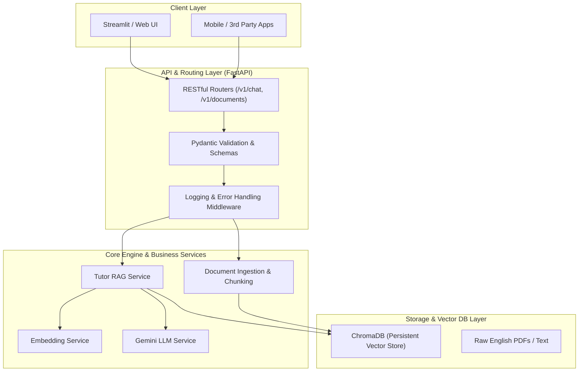

# LỘ TRÌNH DỰ ÁN: ENTERPRISE AI ENGLISH TUTOR RAG (14 NGÀY - 1 GIỜ/NGÀY)

> **Mục tiêu**: Xây dựng hệ thống **RAG Chuyên Dụng Học Tiếng Anh** theo **Tiêu chuẩn Kỹ thuật Doanh nghiệp (Enterprise Production-Grade)**: Clean Architecture, FastAPI Backend, Vector Database, Structured Logging, Pydantic Type-Safety và Dockerization.

---

## 🎯 1. Kiến trúc tổng thể hệ thống (System Architecture)

---

## 🔄 2. Quy trình làm việc hàng ngày (Daily Workflow)
1. **Check-in & Đọc tài liệu (10-15 phút)**: Tóm tắt lý thuyết, design patterns, kiến trúc cần áp dụng.
2. **Q&A Kỹ thuật**: Thảo luận về kiến trúc, cấu trúc dữ liệu, thuật toán và thư viện.
3. **Thực chiến 1 giờ**: Tự tay code các module theo chuẩn Clean Code, Type Hinting và Logging.
4. **Review & Lưu tài liệu**: Ghi chú kiến thức vào `docs/DAY_XX.md`.

---

## 📅 3. Chi tiết lộ trình 14 ngày (Chuẩn Doanh Nghiệp)

### 🔰 TUẦN 1: XÂY DỰNG CORE ENGINE & CLEAN ARCHITECTURE

#### **Ngày 1: Thiết lập môi trường, Config Pydantic & Kết nối AI API**
- **Lý thuyết**: Cấu trúc project chuẩn công ty, cơ chế Text Embedding & LLM, bảo mật `.env`.
- **Nhiệm vụ**: Cấu hình môi trường (`conda`/`venv`), viết script test LLM (`gemini-3.6-flash`) và Embedding (`gemini-embedding-001`).
- **Output**: File `test/test_api.py` và tài liệu [docs/DAY_01.md](file:///c:/Users/Nguyen%20Duc%20Vu%20Bao/Desktop/RAG/docs/DAY_01.md).

#### **Ngày 2: Document Ingestion Service & Text Cleaning chuẩn ngữ liệu**
- **Lý thuyết**: Xử lý PDF văn bản (`pypdf`), quy tắc làm sạch dữ liệu sách tiếng Anh (xử lý hyphenation, bullet points, header/footer).
- **Nhiệm vụ**: Xây dựng `DocumentService` đọc PDF, chuẩn hóa chuỗi và trích xuất Metadata có cấu trúc (`book_title`, `page_number`, `unit`).
- **Output**: Module `src/services/document_service.py`.

#### **Ngày 3: Chunking Service theo ngữ cảnh học tiếng Anh**
- **Lý thuyết**: Kỹ thuật Semantic & Recursive Chunking, bài toán giữ trọn `Quy tắc ngữ pháp + Ví dụ minh họa` trong 1 chunk.
- **Nhiệm vụ**: Viết `ChunkingService` chia nhỏ văn bản có overlap, gắn metadata truy vết cho từng chunk.
- **Output**: Module `src/services/chunker_service.py` kèm unit test.

#### **Ngày 4: Bản chất Vector Similarity & Toán học trong AI Search**
- **Lý thuyết**: Semantic Vector Space, Cosine Similarity, Dot Product, ma trận hóa tìm kiếm bằng NumPy.
- **Nhiệm vụ**: Tự viết thuật toán tìm kiếm vector thuần bằng NumPy trước khi dùng Database để hiểu sâu bản chất toán học.
- **Output**: Module `test/test_similarity.py` xếp hạng Top-k đoạn văn bản liên quan.

#### **Ngày 5: Vector Store Repository (Tích hợp ChromaDB)**
- **Lý thuyết**: Thiết kế mẫu Repository Pattern cho Vector Database (Collection management, Persistence, Metadata Filtering).
- **Nhiệm vụ**: Xây dựng `ChromaVectorStore` hỗ trợ Ingest dữ liệu và Query Top-k chunks kèm lọc metadata (`book`, `page`).
- **Output**: Module `src/vector_store/chroma_store.py`.

#### **Ngày 6: Xây dựng RAG Engine & Grounded Prompting**
- **Lý thuyết**: Kỹ thuật Grounded Prompting chống ảo giác (Hallucination), cấu trúc System Prompt định hình Gia sư Tiếng Anh song ngữ.
- **Nhiệm vụ**: Nối luồng hoàn chỉnh: `User Query` $\rightarrow$ `Retrieve Top-k` $\rightarrow$ `Format Prompt` $\rightarrow$ `LLM Generation`.
- **Output**: Module `src/services/rag_service.py`.

#### **Ngày 7: Source Citations & Hoàn thành Milestone 1 (Core CLI Engine)**
- **Lý thuyết**: Kỹ thuật trích dẫn nguồn gốc chính xác (`[Nguồn: Sách X, Trang Y]`), CLI Interface tương tác trực tiếp.
- **Nhiệm vụ**: Hoàn thiện CLI tương tác hỏi đáp liên tục, test 5 ca thực tế (Ngữ pháp, Collocation, Phrasal Verbs).
- **🎯 Milestone 1**: Core RAG Engine chạy độc lập, cấu trúc Clean Code, đạt chuẩn Unit Test.

---

### 🚀 TUẦN 2: XÂY DỰNG FASTAPI BACKEND, STREAMLIT UI & ĐÓNG GÓI DOCKER

#### **Ngày 8: Xây dựng RESTful API Backend với FastAPI**
- **Lý thuyết**: Kiến trúc Web API với FastAPI, Pydantic Schemas, Dependency Injection, Swagger Documentation (`/docs`).
- **Nhiệm vụ**: Tạo các endpoints: `POST /api/v1/chat`, `POST /api/v1/documents/upload`, `GET /health`.
- **Output**: Server FastAPI chạy tại `http://localhost:8000`.

#### **Ngày 9: Streaming Response & Quản lý hội thoại (Conversational Memory)**
- **Lý thuyết**: Server-Sent Events (SSE) để stream câu trả lời từng từ, kỹ thuật Condense Question giải quyết câu hỏi nối tiếp.
- **Nhiệm vụ**: Nâng cấp API hỗ trợ Streaming và ghi nhớ lịch sử hội thoại nhiều lượt.
- **Output**: Endpoint `POST /api/v1/chat/stream`.

#### **Ngày 10: Tính năng nâng cao: Tạo Quiz & Flashcard tự động**
- **Lý thuyết**: Structured Outputs (JSON Schema / Pydantic) ép LLM trả về cấu trúc trắc nghiệm chuẩn xác 100%.
- **Nhiệm vụ**: Xây dựng tính năng tạo 3 câu hỏi trắc nghiệm từ bài học kèm đáp án và giải thích chi tiết.
- **Output**: Endpoint `POST /api/v1/quiz/generate`.

#### **Ngày 11: Tính năng nâng cao: "Check My English" đối chiếu tài liệu**
- **Lý thuyết**: Error Analysis Prompting, cơ chế tra cứu quy tắc ngữ pháp tương ứng với lỗi người học mắc phải.
- **Nhiệm vụ**: Xây dựng API kiểm tra câu tiếng Anh của học viên, chỉ ra lỗi sai và dẫn chứng quy tắc trong sách.
- **Output**: Endpoint `POST /api/v1/tutor/check-grammar`.

#### **Ngày 12: Dựng Giao diện Web UI trực quan với Streamlit**
- **Lý thuyết**: Kết nối Frontend với FastAPI Backend, thiết kế giao diện Chat hiện đại, Sidebar quản lý tài liệu.
- **Nhiệm vụ**: Xây dựng Web App tương tác đầy đủ các tính năng: Chatbot tra cứu, Làm Quiz, Sửa lỗi câu.
- **Output**: Giao diện Web chạy tại `http://localhost:8501`.

#### **Ngày 13: Đánh giá chất lượng RAG (RAG Triad) & Tối ưu hóa Retrieval**
- **Lý thuyết**: Bộ 3 tiêu chí RAG Triad (Context Relevance, Groundedness, Answer Relevance), kỹ thuật lọc ngưỡng Distance Threshold.
- **Nhiệm vụ**: Chạy bộ test 10 câu hỏi thực tế, đánh giá điểm số và tối ưu prompt/retrieval.
- **Output**: Báo cáo đánh giá chất lượng `docs/evaluation_report.md`.

#### **Ngày 14: Đóng gói Docker, Viết README & Hoàn thiện Portfolio**
- **Lý thuyết**: Containerization với Docker & Docker Compose, quy chuẩn viết Technical README cho dự án AI.
- **Nhiệm vụ**:
  - Viết `Dockerfile` và `docker-compose.yml` (khởi chạy cả Backend + Frontend chỉ với 1 lệnh).
  - Viết `README.md` chuyên nghiệp với sơ đồ kiến trúc Mermaid, hướng dẫn cài đặt và demo ảnh GIF.
- **🎯 Milestone 2**: Dự án Production-Grade hoàn chỉnh 100%, sẵn sàng đưa lên GitHub và CV xin việc.

