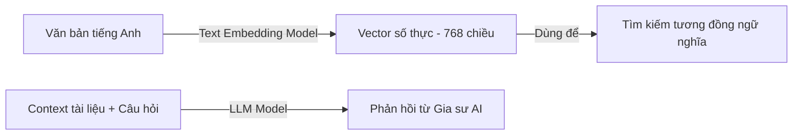

# 📘 NGÀY 1: THIẾT LẬP MÔI TRƯỜNG & KẾT NỐI LLM / TEXT EMBEDDING API

> **Dự án**: AI English Tutor RAG (14 Ngày)  
> **Mục tiêu Ngày 1**: Hiểu bản chất hoạt động của LLM & Text Embedding API, thiết lập môi trường Python chuẩn, quản lý API key bảo mật và viết script kiểm tra kết nối độc lập.

---

## 📑 MỤC LỤC
1. [Khái niệm cốt lõi (Core Concepts)](#1-khái-niệm-cốt-lõi-core-concepts)
2. [Các thư viện sử dụng (Libraries)](#2-các-thư-viện-sử-dụng-libraries)
3. [Phân tích chi tiết mã nguồn (`test_api.py`)](#3-phân-tích-chi-tiết-mã-nguồn-test_apipy)
4. [Các lỗi thường gặp & Cách khắc phục (Troubleshooting)](#4-các-lỗi-thường-gặp--cách-khắc-phục-troubleshooting)
5. [Tổng kết & Chuẩn bị cho Ngày 2](#5-tổng-kết--chuẩn-bị-cho-ngày-2)

---

## 🧠 1. Khái niệm cốt lõi (Core Concepts)

### 1.1. Hai thành phần AI nền tảng trong RAG
Trong bất kỳ hệ thống RAG (Retrieval-Augmented Generation) nào, có 2 khối AI độc lập nhưng phối hợp chặt chẽ:



1. **Text Embedding Model (`gemini-embedding-001` / `text-embedding-004`)**:
   - **Bản chất**: Nhận vào một chuỗi văn bản bất kỳ và biến đổi nó thành một vector số thực (mảng 1 chiều cố định, ví dụ 768 hoặc 1536 chiều).
   - **Đặc tính**: Các câu có **ngữ nghĩa tương đồng** (dù dùng từ ngữ khác nhau) sẽ có vector nằm **gần nhau** trong không gian nhiều chiều.
   - **Ví dụ**:
     - Câu A: *"How to use the present perfect tense?"*
     - Câu B: *"Explain present perfect usage in English"*
     - $\rightarrow$ Vector của A và B sẽ có độ tương đồng (Cosine Similarity) rất cao (> 0.85).

2. **Large Language Model - LLM (`gemini-3.6-flash`)**:
   - **Bản chất**: Mô hình tạo sinh ngôn ngữ lớn, dự đoán và sinh từ ngữ tiếp nối dựa trên ngữ cảnh được cung cấp.
   - **Vai trò trong dự án**: Đóng vai trò **Gia sư Tiếng Anh song ngữ (Bilingual Tutor)**, nhận ngữ cảnh từ sách/tài liệu và câu hỏi của học viên để giải thích rõ ràng, chuẩn ngữ pháp.

### 1.2. Quản lý biến môi trường (`.env`)
- **Tại sao cần `.env`?** Khóa API (`GEMINI_API_KEY`) mang tính chất bảo mật cá nhân và liên kết với tài khoản thanh toán/hạn ngạch. Không bao giờ được hard-code trực tiếp vào mã nguồn.
- File `.env` được cấu hình nằm trong `.gitignore` để Git tự động bỏ qua, không bị đẩy lên GitHub.

---

## 📦 2. Các thư viện sử dụng (Libraries)

| Thư viện | Tên gói cài đặt | Mục đích sử dụng |
| :--- | :--- | :--- |
| `os` | *Có sẵn trong Python* | Đọc biến môi trường hệ thống (`os.getenv`). |
| `dotenv` | `python-dotenv` | Tự động đọc các cặp `KEY=VALUE` trong file `.env` và nạp vào biến môi trường. |
| `google.genai` | `google-genai` | SDK chính thức thế hệ mới của Google để gọi các mô hình Gemini. |
| `google.genai.types` | *Đi kèm `google-genai`* | Cung cấp các kiểu dữ liệu và schema cấu hình (`GenerateContentConfig`). |

---

## 💻 3. Phân tích chi tiết mã nguồn (`test_api.py`)

File: [test/test_api.py](file:///c:/Users/Nguyen%20Duc%20Vu%20Bao/Desktop/RAG/test/test_api.py)

```python
import os
from dotenv import load_dotenv
from google import genai
from google.genai import types
```
- **`load_dotenv()`**: Quét và nạp các biến từ file `.env` vào bộ nhớ.
- **`from google import genai`**: Import module chính của Google GenAI SDK.

```python
load_dotenv()
api_key = os.getenv("GEMINI_API_KEY")

if not api_key:
    raise ValueError("❌ Không tìm thấy GEMINI_API_KEY trong file .env!")

client = genai.Client(api_key=api_key)
```
---

## 🛠️ 3. Từ điển chi tiết các Hàm & Phương thức (Function Reference)

Dưới đây là bảng tra cứu chi tiết từng hàm xuất hiện trong bài, bao gồm: **Nhiệm vụ**, **Tham số đầu vào (Input)** và **Giá trị trả về (Output)**:

### 1️⃣ `load_dotenv()`
- **Thuộc thư viện**: `python-dotenv`
- **Tác dụng**: Tìm file `.env` ở thư mục hiện tại, đọc từng dòng `KEY=VALUE` và nạp vào biến môi trường của hệ điều hành trong suốt phiên chạy script.
- **Input**: Mặc định không cần truyền tham số (tự tìm `.env`).
- **Output**: Trả về `True` nếu tìm thấy và nạp thành công file `.env`, ngược lại trả về `False`.

---

### 2️⃣ `os.getenv(key, default=None)`
- **Thuộc thư viện**: `os` (chuẩn Python)
- **Tác dụng**: Lấy giá trị của một biến môi trường theo tên `key`.
- **Input**:
  - `key` (str): Tên biến môi trường cần lấy (ví dụ: `"GEMINI_API_KEY"`).
- **Output**: Chuỗi giá trị (`str`) nếu biến tồn tại; nếu không có sẽ trả về `None` (an toàn hơn `os.environ[key]` vốn sẽ làm crash chương trình nếu thiếu key).

---

### 3️⃣ `genai.Client(api_key=...)`
- **Thuộc thư viện**: `google.genai`
- **Tác dụng**: Hàm khởi tạo (Constructor) tạo đối tượng `Client` quản lý kết nối, xác thực và gửi các yêu cầu đến máy chủ Google GenAI.
- **Input**:
  - `api_key` (str): Chuỗi khóa bí mật Google API Key.
- **Output**: Một đối tượng `Client` chứa các module con: `client.models`, `client.chats`, `client.files`,...

---

### 4️⃣ `types.GenerateContentConfig(...)`
- **Thuộc thư viện**: `google.genai.types`
- **Tác dụng**: Lớp cấu hình dùng để gom nhóm các tham số điều khiển hành vi của LLM khi sinh văn bản.
- **Input thường dùng**:
  - `system_instruction` (str): Lời nhắc hệ thống định hình vai trò/nhân vật (ví dụ: Gia sư Tiếng Anh).
  - `temperature` (float, tuỳ chọn): Độ sáng tạo của model (từ `0.0` đến `2.0`). RAG tra cứu sự thật thường dùng `0.0` - `0.3`.
  - `max_output_tokens` (int, tuỳ chọn): Giới hạn số lượng từ sinh ra.
- **Output**: Đối tượng cấu hình hợp lệ để truyền vào tham số `config` của hàm `generate_content`.

---

### 5️⃣ `client.models.generate_content(...)`
- **Thuộc thư viện**: `google.genai` (phương thức của `client.models`)
- **Tác dụng**: Gửi câu hỏi/prompt tới mô hình ngôn ngữ lớn (LLM) và nhận văn bản phản hồi do AI sinh ra.
- **Input**:
  - `model` (str): Tên định danh của mô hình (ví dụ: `"gemini-3.6-flash"`).
  - `contents` (str hoặc list): Nội dung câu hỏi/yêu cầu của người dùng.
  - `config` (GenerateContentConfig, tuỳ chọn): Cấu hình bổ sung (system instruction, temperature,...).
- **Output**: Một đối tượng `GenerateContentResponse`, trong đó:
  - `response.text` (str): Chứa nội dung câu trả lời hoàn chỉnh dạng văn bản.

---

### 6️⃣ `client.models.embed_content(...)`
- **Thuộc thư viện**: `google.genai` (phương thức của `client.models`)
- **Tác dụng**: Gửi một đoạn văn bản lên máy chủ AI để tính toán và chuyển đổi thành một **vector nhúng (embedding)** số học.
- **Input**:
  - `model` (str): Tên mô hình embedding (ví dụ: `"gemini-embedding-001"`).
  - `contents` (str hoặc list): Câu văn/đoạn văn cần tính vector.
- **Output**: Một đối tượng `EmbedContentResponse`, trong đó:
  - `response.embeddings`: Danh sách các vector nhúng được tạo ra.
  - `response.embeddings[0].values`: Danh sách các số thực (`list[float]`) biểu diễn vector ngữ nghĩa của đoạn văn bản.

---

### 7️⃣ `len(sequence)`
- **Thuộc thư viện**: Hàm tích hợp sẵn của Python (Built-in function).
- **Tác dụng**: Đếm và trả về tổng số phần tử của một danh sách (list), chuỗi (string), tuple hoặc mảng.
- **Trong bài**: `len(embedding_vector)` trả về số chiều (ví dụ `768`), cho biết vector ngữ nghĩa này gồm bao nhiêu con số thực.

---

### 8️⃣ `print(*values)`
- **Thuộc thư viện**: Hàm tích hợp sẵn của Python (Built-in function).
- **Tác dụng**: Xuất dữ liệu/thông báo ra màn hình dòng lệnh (Terminal / Console).

---

### 9️⃣ Hai hàm tự viết: `test_llm_chat()` và `test_embedding()`
- **Tác dụng**: Đóng gói logic kiểm thử thành từng module độc lập:
  - `test_llm_chat()`: Chuyên trách test xem phần "Gia sư AI sinh lời giải" có hoạt động đúng vai trò không.
  - `test_embedding()`: Chuyên trách test xem phần "Tạo vector số học để tìm kiếm tài liệu sau này" có trả về vector hợp lệ không.


### 🔹 Hàm 1: `test_llm_chat()` – Kiểm thử Gia sư AI
```python
def test_llm_chat():
    print("\n--- 1. TEST LLM (ENGLISH TUTOR) ---")
    system_instruction = (
        "Bạn là một Gia sư Tiếng Anh (English Tutor) thông thái và thân thiện. "
        "Nhiệm vụ của bạn là giải thích ngắn gọn, dễ hiểu ngữ pháp và từ vựng tiếng Anh "
        "bằng tiếng Việt, kèm theo ví dụ chuẩn tiếng Anh."
    )
    prompt = "Giải thích ngắn gọn sự khác nhau giữa 'Present Perfect' và 'Past Simple'."
    
    config = types.GenerateContentConfig(
        system_instruction=system_instruction,
    )
    
    response = client.models.generate_content(
        model="gemini-3.6-flash",
        contents=prompt,
        config=config,
    )
    print(response.text)
```
- **`system_instruction` (System Prompt)**: Thiết lập vai trò / phong cách cho LLM trước khi nhận câu hỏi. Giúp AI luôn trả lời dưới góc nhìn sư phạm, giải thích bằng tiếng Việt kèm ví dụ tiếng Anh.
- **`types.GenerateContentConfig`**: Lớp cấu hình chuẩn của SDK truyền chỉ dẫn hệ thống vào request.
- **`client.models.generate_content(...)`**: Gửi request sinh văn bản tới mô hình `gemini-3.6-flash`.
- **`response.text`**: Trích xuất kết quả dạng text trả về từ mô hình.

---

### 🔹 Hàm 2: `test_embedding()` – Kiểm thử Vector Embedding
```python
def test_embedding():
    print("\n--- 2. TEST EMBEDDING ---")
    sample_text = "The present perfect tense is used for actions completed at an unspecified time."
    embed_model = "gemini-embedding-001"
    
    embedding_response = client.models.embed_content(
        model=embed_model,
        contents=sample_text,
    )
    
    embedding_vector = embedding_response.embeddings[0].values
    vector_dim = len(embedding_vector)
    
    print(f"Model: {embed_model}")
    print(f"Câu mẫu: '{sample_text}'")
    print(f"Số chiều vector (Dimension): {vector_dim}")
    print(f"5 giá trị đầu tiên của vector: {embedding_vector[:5]}")
```
- **`client.models.embed_content(...)`**: Gửi văn bản lên mô hình embedding để tính toán vector.
- **`embedding_response.embeddings[0].values`**: Trích xuất danh sách các số thực `float` đại diện cho vector của câu đầu tiên.
- **`vector_dim`**: Đo độ dài mảng (ví dụ: `768` chiều). Con số này quyết định kích thước cấu hình database vector ở Ngày 5.

---

### 🔹 Điểm chạy chính (`main`)
```python
if __name__ == "__main__":
    test_llm_chat()
    test_embedding()
```
- Đảm bảo các hàm test chỉ chạy khi thực thi trực tiếp file `test_api.py`.

---

## 🛠️ 4. Các lỗi thường gặp & Cách khắc phục (Troubleshooting)

| Lỗi gặp phải | Nguyên nhân | Cách khắc phục |
| :--- | :--- | :--- |
| `ImportError: cannot import name 'genai' from 'google'` | Chưa cài đặt gói `google-genai` hoặc đang dùng môi trường base chưa kích hoạt conda/venv. | Chạy `conda activate rag` và `pip install google-genai python-dotenv`. |
| `ValueError: No API key was provided` / `api_key is None` | File `.env` chưa có nội dung hoặc đặt sai tên biến `GEMINI_API_KEY`. | Mở `.env`, ghi đúng `GEMINI_API_KEY=AIzaSy...` và lưu lại (`Ctrl + S`). |
| `ClientError: 404 NOT_FOUND` khi gọi model | Dùng tên model cũ / chưa hỗ trợ (ví dụ `gemini-2.0-flash` hoặc `gemini-2.5-flash`). | Cập nhật model sang **`gemini-3.6-flash`** và embedding sang **`gemini-embedding-001`**. |
| `Direct use of automatic function calling (AFC)...` | Truyền `config={"system_instruction": ...}` dạng dict thô khiến SDK hiểu nhầm thành AFC schema. | Dùng `types.GenerateContentConfig(system_instruction=...)`. |

---

## 🏁 5. Tổng kết & Chuẩn bị cho Ngày 2

### ✅ Milestone Ngày 1 Đã Đạt:
- [x] Môi trường ảo Python chuẩn (`rag`) hoạt động ổn định.
- [x] Quản lý API Key an toàn qua `.env` và `python-dotenv`.
- [x] Gọi thành công LLM với System Instruction định hình vai trò Gia sư.
- [x] Lấy được Vector Embedding và nắm rõ khái niệm số chiều vector.

### 🔜 Chuẩn bị cho Ngày 2:
- **Chủ đề**: *Trích xuất văn bản & Làm sạch tài liệu học tiếng Anh từ file PDF*.
- **Mục tiêu**: Viết module đọc PDF từng trang, trích xuất text sạch (loại bỏ header/footer/ký tự thừa), và lưu kèm Metadata (`tên sách`, `trang`).
