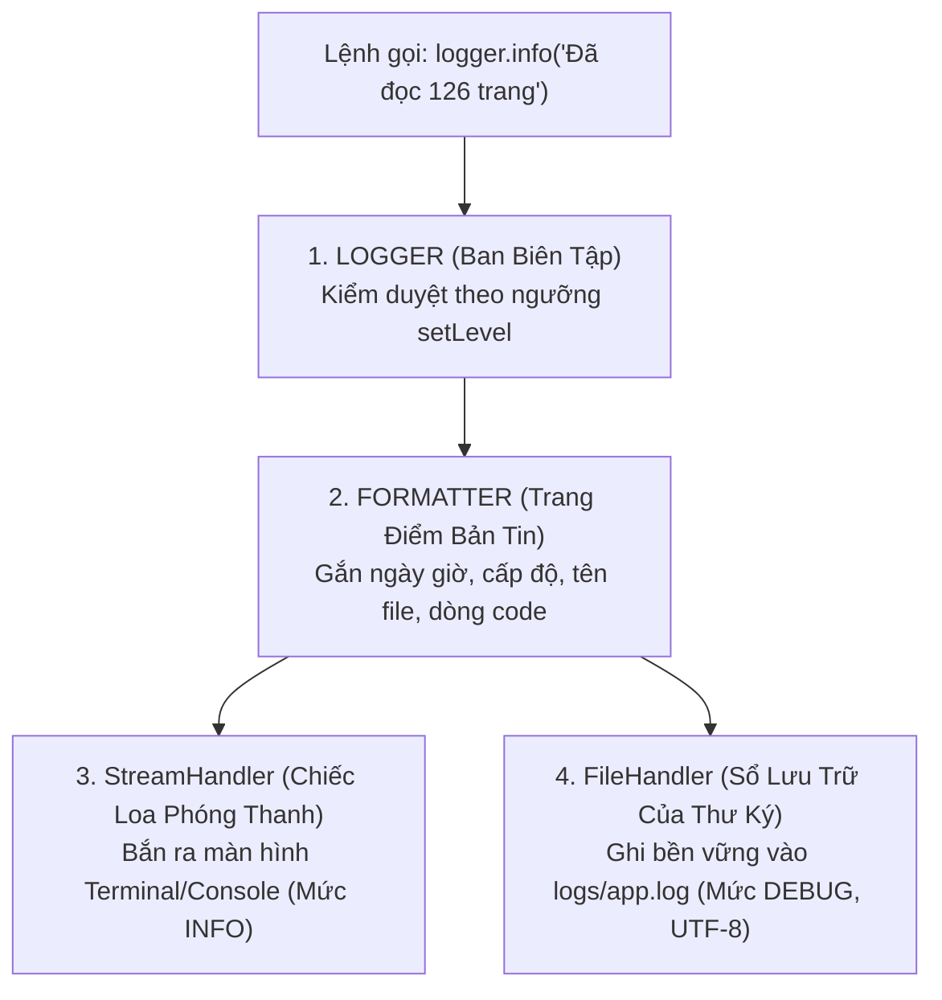
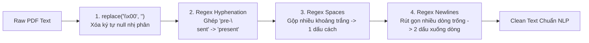

# 📘 NGÀY 2: DOCUMENT INGESTION SERVICE & TEXT CLEANING CHUẨN NGỮ LIỆU

> **Dự án**: AI English Tutor RAG (14 Ngày)  
> **Trọng tâm Ngày 2**: Nắm vững lý thuyết và công dụng các thư viện cốt lõi (`pypdf`, `pydantic`, `re`, `logging`, `pathlib`); phân tích sâu luồng hoạt động của hệ thống Logging đa kênh; giải mã từng hàm nghiệp vụ; làm chủ Pydantic Type-Safety và rèn luyện kỹ năng Code Review bắt lỗi.

---

## 📑 MỤC LỤC
1. [Công dụng các thư viện sử dụng (Libraries Breakdown)](#1-công-dụng-các-thư-viện-sử-dụng-libraries-breakdown)
2. [Hệ thống Logging: Luồng hoạt động & Các mức độ (Deep Dive)](#2-hệ-thống-logging-luồng-hoạt-động--các-mức-độ-deep-dive)
3. [Chuyên sâu về Pydantic & Type-Safety](#3-chuyên-sâu-về-pydantic--type-safety)
4. [Từ điển & Công dụng chi tiết các hàm trong dự án](#4-từ-điển--công-dụng-chi-tiết-các-hàm-trong-dự-án)
5. [Thuật toán làm sạch ngữ liệu tiếng Anh (`clean_text`)](#5-thuật-toán-làm-sạch-ngữ-liệu-tiếng-anh-clean_text)
6. [Góc Code Review & Bắt lỗi thực chiến (Bug Hunting)](#6-góc-code-review--bắt-lỗi-thực-chiến-bug-hunting)
7. [Kết quả chạy thực tế & Chuẩn bị Ngày 3](#7-kết-quả-chạy-thực-tế--chuẩn-bị-ngày-3)

---

## 📦 1. Công dụng các thư viện sử dụng (Libraries Breakdown)

Trong Ngày 2, chúng ta tích hợp 6 thư viện, mỗi thư viện đảm nhận một mắt xích không thể thay thế trong chuỗi xử lý:

| Thư viện | Phân loại | Công dụng chính trong dự án |
| :--- | :--- | :--- |
| **`pypdf`** | Bên thứ ba (`pypdf>=4.0.0`) | Đọc và giải mã tệp PDF nhị phân. Lập bản đồ các trang và trích xuất luồng ký tự văn bản thô theo tọa độ in ấn. |
| **`pydantic`** | Bên thứ ba (`pydantic>=2.0.0`) | Xây dựng Data Schemas an toàn kiểu (Type-Safe). Tự động kiểm tra tính hợp lệ của dữ liệu đầu vào và chặn đứng lỗi ngầm. |
| **`re`** | Thư viện chuẩn Python | Xử lý biểu thức chính quy (Regular Expressions) để tìm kiếm và thay thế các mẫu chuỗi phức tạp (khử gạch nối, chuẩn hóa khoảng trắng). |
| **`logging`** | Thư viện chuẩn Python | Tạo hệ thống "hộp đen" ghi nhật ký có phân cấp, điều hướng thông điệp log song song ra màn hình Terminal và file lưu trữ. |
| **`pathlib`** | Thư viện chuẩn Python | Quản lý đường dẫn tập tin theo hướng đối tượng (`Path`), giúp code chạy tương thích 100% trên cả Windows, Linux và macOS. |
| **`typing`** | Thư viện chuẩn Python | Cung cấp Type Hints (`List`, `Union`) để code tường minh, giúp IDE hỗ trợ gợi ý code và kiểm tra lỗi kiểu tĩnh. |

---

## 📻 2. Hệ thống Logging: Luồng hoạt động & Các mức độ (Deep Dive)

### 2.1. Tại sao cấm dùng `print()` trong dự án Enterprise?
- `print()` chỉ hiển thị tạm thời trên màn hình console lúc đang chạy. Khi đóng terminal hoặc triển khai ngầm trên Docker/Server, toàn bộ thông tin biến mất vĩnh viễn.
- `print()` không cho biết thông tin đó được in lúc mấy giờ, ở file nào, dòng số bao nhiêu, và không phân loại được mức độ nghiêm trọng.

### 2.2. Luồng hoạt động (Dataflow Pipeline) của Logging
Hệ thống ghi log trong [src/core/logger.py](file:///c:/Users/Nguyen%20Duc%20Vu%20Bao/Desktop/RAG/src/core/logger.py) vận hành như một **Đài phát thanh truyền hình**:



1. **`Logger` (Ban Biên Tập)**: Tiếp nhận mẩu tin và so sánh mức độ nghiêm trọng với cấu hình `setLevel`.
2. **`Formatter` (Trang Điểm)**: Khoác lên mẩu tin cái khung chuẩn: `[Thời gian] [Cấp độ] [File:Dòng] - Nội dung`.
3. **`Handler` (Kênh Phân Phối)**:
   - **`StreamHandler(sys.stdout)`**: Đẩy log ra màn hình console cho lập trình viên theo dõi trực tiếp.
   - **`FileHandler(LOG_FILE, encoding='utf-8')`**: Chép log vào file cứng [logs/app.log](file:///c:/Users/Nguyen%20Duc%20Vu%20Bao/Desktop/RAG/logs/app.log), lưu trữ vĩnh viễn và hỗ trợ hiển thị tiếng Việt không bị lỗi font.

### 2.3. Chi tiết 5 Mức độ Log (Log Levels) & Cơ chế lọc `setLevel`

Python chia thông điệp thành 5 cấp bậc nghiêm trọng tăng dần (đánh số từ 10 đến 50):

| Cấp độ | Giá trị số | Màu sắc biểu thị | Ý nghĩa & Ví dụ trong dự án |
| :--- | :---: | :---: | :--- |
| **`DEBUG`** | 10 | Xám | **Chi tiết vụn vặt**: Dùng khi gỡ lỗi. Ví dụ: *"Biến `idx` đang bằng 5"*, *"Vừa đọc byte 1024"*. |
| **`INFO`** | 20 | Xanh lá / Lam | **Sự kiện bình thường**: Tiến trình chạy trơn tru. Ví dụ: *"Đã nạp thành công 126 trang PDF"*. |
| **`WARNING`**| 30 | Vàng | **Cảnh báo nguy cơ**: Chưa sập nhưng bất thường. Ví dụ: *"Trang 15 là trang trắng (không có chữ)"*. |
| **`ERROR`** | 40 | Đỏ | **Sự cố một tính năng**: Đã thất bại 1 nhiệm vụ. Ví dụ: *"Không tìm thấy file PDF tại đường dẫn"*. |
| **`CRITICAL`**| 50 | Đỏ chớp nháy | **Thảm họa sập hệ thống**: Toàn bộ server ngừng hoạt động. Ví dụ: *"Tràn bộ nhớ / Cháy ổ đĩa"*. |

👉 **Cơ chế bộ lọc `setLevel`**: 
- Khi ta đặt `logger.setLevel(logging.INFO)` (ngưỡng 20), tất cả những thông điệp có trọng số nhỏ hơn 20 (như `DEBUG = 10`) sẽ **bị chặn lại**. Chỉ các thông điệp có trọng số $\ge 20$ (`INFO`, `WARNING`, `ERROR`, `CRITICAL`) mới được xuất ra.
- Trong dự án của ta: **Console Handler** lọc ở mức `INFO` để màn hình sạch sẽ; **File Handler** ghi nhận từ mức `DEBUG` để khi cần điều tra lỗi sâu có đầy đủ vết tích.

---

## 🛡️ 3. Chuyên sâu về Pydantic & Type-Safety

### 3.1. Tại sao không dùng Dictionary thông thường (`dict`)?
* **Rủi ro của `dict`**:
  ```python
  # Ngây thơ dùng dict:
  page = {"content": "Hello", "page_num": 1}
  # Chỗ khác lại truy xuất:
  print(page["page_number"])  # -> SẬP CHƯƠNG TRÌNH VÌ KeyError: 'page_number'
  ```
  Nếu ai đó truyền `"page_num"` là chuỗi `"trang 1"` thay vì số nguyên, Python không hề báo lỗi ngay mà để trôi sâu vào trong hệ thống, gây lỗi dây chuyền rất khó truy vết.

### 3.2. Sức mạnh của Pydantic `BaseModel` và `Field`
Pydantic đóng vai trò như một **Nhân viên hải quan kiểm soát chất lượng dữ liệu**:

```python
class DocumentMetadata(BaseModel):
    source: str = Field(description="Tên file hoặc nguồn gốc của tài liệu")
    page_number: int = Field(ge=1, description="Số thứ tự trang (bắt đầu từ 1)")
    total_pages: int = Field(ge=1, description="Tổng số trang của tài liệu")
    char_count: int = Field(ge=0, description="Số lượng ký tự văn bản sau làm sạch")
```

1. **Ép kiểu dữ liệu nghiêm ngặt**:
   - Nếu truyền `page_number = "abc"`, Pydantic chặn đứng ngay cửa vào và ném lỗi `ValidationError`.
2. **Ràng buộc toán học bằng `Field`**:
   - `ge=1` (*Greater than or equal to 1*): Số trang trong sách thực tế không bao giờ có trang 0 hoặc trang âm. Nếu ai đó truyền `0` hoặc `-5`, Pydantic lập tức từ chối.
   - `ge=0`: Số lượng ký tự trong trang tối thiểu phải bằng 0.
3. **Tính truy vết nguồn gốc (Traceability) trong RAG**:
   - Mỗi `DocumentPage` luôn mang theo `DocumentMetadata`. Khi học viên hỏi bài, hệ thống RAG có thể trích dẫn chính xác: *"[Nguồn: Ngữ pháp tiếng Anh cơ bản - IELTS Fighter.pdf, Trang 45]"*.

---

## 🔍 4. Từ điển & Công dụng Chi tiết các Hàm CÓ SẴN của Thư viện được gọi trong dự án

Dưới đây là danh mục toàn bộ các **hàm, phương thức và thuộc tính có sẵn của các thư viện** mà mã nguồn dự án Ngày 2 đã trực tiếp gọi và sử dụng:

---

### 4.1. Nhóm thư viện `logging` (Hệ thống ghi log)
| Hàm / Phương thức có sẵn | Cú pháp gọi trong dự án | Công dụng & Bản chất kỹ thuật |
| :--- | :--- | :--- |
| **`logging.getLogger(name)`** | `logger = logging.getLogger(name)` | Tìm hoặc khởi tạo một đối tượng `Logger` theo tên định danh. Nếu tên đã tồn tại, nó trả về cùng một instance (tránh tạo trùng lặp). |
| **`logger.setLevel(level)`** | `logger.setLevel(logging.DEBUG)` | Thiết lập ngưỡng lọc mức độ nghiêm trọng cho Logger. Mọi log thấp hơn mức này sẽ bị chặn ngay từ đầu. |
| **`logging.Formatter(fmt, datefmt)`** | `formatter = logging.Formatter(...)` | Tạo khuôn mẫu định dạng cho thông điệp log: quy định vị trí hiển thị ngày giờ (`%(asctime)s`), cấp độ (`%(levelname)s`), vị trí file và dòng (`%(filename)s:%(lineno)d`). |
| **`logging.StreamHandler(stream)`** | `logging.StreamHandler(sys.stdout)` | Tạo một Handler để chuyển hướng luồng dữ liệu log ra màn hình console/terminal thông qua luồng chuẩn `sys.stdout`. |
| **`logging.FileHandler(filename, encoding)`** | `logging.FileHandler(LOG_FILE, encoding="utf-8")` | Tạo một Handler để mở và ghi bền vững các dòng log vào file trên ổ đĩa. Tham số `encoding="utf-8"` bảo đảm tiếng Việt không bị lỗi font. |
| **`handler.setLevel(level)`** | `console_handler.setLevel(logging.INFO)` | Cài đặt ngưỡng lọc riêng biệt cho từng Handler (ví dụ: Terminal chỉ nhận `INFO`, còn File nhận từ `DEBUG`). |
| **`handler.setFormatter(formatter)`** | `console_handler.setFormatter(formatter)` | Gắn mẫu khung định dạng chữ đã tạo vào chiếc Handler cụ thể đó. |
| **`logger.addHandler(handler)`** | `logger.addHandler(console_handler)` | Đăng ký một kênh phân phối (loa ngoài hoặc file) vào đối tượng Logger. |
| **`logger.info()` / `warning()` / `error()`** | `logger.info("Bắt đầu trích xuất...")` | Phát thông điệp ra các Handler với cấp độ nghiêm trọng tương ứng (`INFO=20`, `WARNING=30`, `ERROR=40`). |

---

### 4.2. Nhóm thư viện `pypdf` (Đọc và phân giải PDF)
| Hàm / Thuộc tính có sẵn | Cú pháp gọi trong dự án | Công dụng & Bản chất kỹ thuật |
| :--- | :--- | :--- |
| **`PdfReader(path)`** | `reader = PdfReader(str(path))` | Phân tích cấu trúc nhị phân của file PDF, giải mã bảng mục lục trang (xref table) để chuẩn bị đọc nội dung. |
| **`reader.pages`** | `total_pages = len(reader.pages)`<br>`for idx, page in enumerate(reader.pages):` | Thuộc tính trả về danh sách (sequence) các đối tượng `PageObject` tương ứng với từng trang trong cuốn sách. |
| **`page.extract_text()`** | `raw_text = page.extract_text() or ""` | Duyệt qua các luồng lệnh vẽ chữ (content streams) trên trang và trích xuất thành chuỗi ký tự. Nếu trang rỗng hoặc là ảnh scan, hàm trả về `None`. |

---

### 4.3. Nhóm thư viện `pydantic` (Data Modeling & Type Safety)
| Lớp / Hàm có sẵn | Cú pháp gọi trong dự án | Công dụng & Bản chất kỹ thuật |
| :--- | :--- | :--- |
| **`BaseModel`** | `class DocumentMetadata(BaseModel):` | Lớp cha cơ sở của Pydantic. Mọi class kế thừa từ `BaseModel` sẽ tự động có khả năng ép kiểu, validate dữ liệu lúc khởi tạo và chuyển đổi sang JSON/dict. |
| **`Field(ge=..., description=...)`** | `page_number: int = Field(ge=1, description="...")` | Hàm thiết lập quy tắc ràng buộc cho từng thuộc tính:<br>• `ge=1` (*Greater than or equal to 1*): Bắt buộc số trang $\ge 1$.<br>• `description`: Chú thích tài liệu hóa cho trường dữ liệu. |

---

### 4.4. Nhóm thư viện `re` (Regular Expressions - Biểu thức chính quy)
| Hàm có sẵn | Cú pháp gọi trong dự án | Công dụng & Bản chất kỹ thuật |
| :--- | :--- | :--- |
| **`re.sub(pattern, repl, string)`** | `re.sub(r"(\b[a-zA-Z]+)-\s*\n\s*([a-zA-Z]+\b)", r"\1\2", cleaned)` | Tìm kiếm tất cả các vị trí khớp với mẫu quy tắc `pattern` trong chuỗi `string` và thay thế bằng chuỗi `repl`. Hỗ trợ tham chiếu nhóm `\1`, `\2` để ghép từ bị cắt đôi. |

---

### 4.5. Nhóm thư viện `pathlib` (Xử lý đường dẫn file)
| Hàm / Thuộc tính có sẵn | Cú pháp gọi trong dự án | Công dụng & Bản chất kỹ thuật |
| :--- | :--- | :--- |
| **`Path(__file__)`** | `BASE_DIR = Path(__file__).resolve().parent.parent.parent` | Khởi tạo đối tượng đường dẫn đại diện cho file code đang chạy. |
| **`path.resolve()`** | `path = Path(file_path).resolve()` | Chuyển đổi một đường dẫn (dù là tương đối `../` hay symlink) thành đường dẫn tuyệt đối chuẩn xác trên ổ cứng. |
| **`path.parent`** | `ROOT_DIR = Path(__file__).resolve().parent.parent` | Thuộc tính trả về thư mục cha chứa đường dẫn hiện tại (giúp lùi lại từng cấp thư mục). |
| **Toán tử `/`** | `LOG_FILE = LOG_DIR / "app.log"` | Nạp chồng toán tử `/` của Python để ghép nối đường dẫn thư mục và file một cách tự nhiên, tự động dùng `\` trên Windows và `/` trên Linux. |
| **`path.exists()`** | `if not path.exists():` | Kiểm tra xem file hoặc thư mục có thực sự tồn tại trên ổ cứng hay không (trả về `True`/`False`). |
| **`path.mkdir(parents=..., exist_ok=...)`** | `LOG_DIR.mkdir(parents=True, exist_ok=True)` | Tạo thư mục mới:<br>• `parents=True`: Tự tạo cả các thư mục cha nếu chưa có.<br>• `exist_ok=True`: Nếu thư mục đã tồn tại thì bỏ qua, không ném lỗi. |
| **`path.name`** | `logger.info(f"Đọc file: {path.name}")` | Thuộc tính trả về phần tên tệp tin kèm đuôi mở rộng (ví dụ: `"IELTS_Fighter.pdf"`). |

---

### 4.6. Nhóm Hàm dựng sẵn của Python (Built-in Functions)
| Hàm có sẵn | Cú pháp gọi trong dự án | Công dụng & Bản chất kỹ thuật |
| :--- | :--- | :--- |
| **`enumerate(iterable)`** | `for idx, page in enumerate(reader.pages):` | Bọc lấy một danh sách và trả về từng cặp `(chỉ_số, phần_tử)`. Chỉ số bắt đầu đếm từ 0. |
| **`len()`** | `len(reader.pages)`, `len(cleaned_text)` | Trả về tổng số phần tử trong danh sách hoặc độ dài số ký tự trong một chuỗi. |
| **`str.replace(old, new)`** | `text.replace("\x00", "").replace("\x0c", "")` | Thay thế chuỗi con đơn giản: dùng để loại bỏ các ký tự điều khiển rác do nhị phân PDF sinh ra. |
| **`str.strip()`** | `return cleaned.strip()` | Cắt tỉa và loại bỏ toàn bộ khoảng trắng, dấu cách thừa ở đầu và cuối chuỗi văn bản. |
| **`sys.path.insert(index, path)`** | `sys.path.insert(0, str(ROOT_DIR))` | Chèn đường dẫn thư mục gốc vào danh sách tìm kiếm module của Python ở vị trí ưu tiên cao nhất (`0`), sửa dứt điểm lỗi `ModuleNotFoundError`. |

---

## 🧹 5. Thuật toán làm sạch ngữ liệu tiếng Anh (`clean_text`)

Tại sao không thể đưa thẳng chữ từ PDF vào mô hình AI? Vì PDF chứa các "bẫy" ngữ liệu:



* **Công thức Regex khử Hyphenation**:
  ```python
  re.sub(r"(\b[a-zA-Z]+)-\s*\n\s*([a-zA-Z]+\b)", r"\1\2", cleaned)
  ```
  - `(\b[a-zA-Z]+)` (Nhóm 1): Một từ tiếng Anh hoàn chỉnh ở cuối dòng.
  - `-\s*\n\s*`: Dấu gạch nối `-`, các dấu cách thừa và dấu xuống dòng `\n`.
  - `([a-zA-Z]+\b)` (Nhóm 2): Nửa từ còn lại bị đẩy xuống dòng tiếp theo.
  - `r"\1\2"`: Ghép liền Nhóm 1 và Nhóm 2 lại với nhau, xóa bỏ hoàn toàn dấu gạch nối và ký tự xuống dòng ở giữa.

---

## 🔍 6. Góc Code Review & Bắt lỗi thực chiến (Bug Hunting)

Trong buổi học hôm nay, chúng ta đã bắt và phân tích tận gốc **2 lỗi kinh điển** của lập trình viên:

### 🔴 Lỗi 1: `NameError: name 'Logging' is not defined`
* **Triệu chứng**: Khi gõ `formatter = Logging.Formatter(...)`.
* **Bản chất**: Python là ngôn ngữ phân biệt chữ hoa/thường (case-sensitive). Ở đầu file viết `import logging` (chữ thường) nhưng khi gọi lại viết `Logging` (chữ hoa). Python không tìm thấy đối tượng nào tên là `Logging` và quăng lỗi sập chương trình.
* **Kỹ năng Review**: Luôn soi kỹ tên biến/module xem có bị viết hoa nhầm chữ cái đầu hay không.

### 🔴 Lỗi 2: `ModuleNotFoundError: No module named 'src'`
* **Triệu chứng**: Khi đứng ở thư mục gốc chạy `python test/test_document_service.py`, dòng lệnh `from src.core.logger import logger` bị báo lỗi không tìm thấy `src`.
* **Bản chất**: Python mặc định đưa thư mục chứa chính script đó (`test/`) vào vị trí ưu tiên số 1 của đường dẫn tìm kiếm module (`sys.path[0]`). Khi tìm `src/` bên trong `test/` không thấy, Python sẽ báo lỗi.
* **Kỹ năng Review & Giải pháp**: Thêm đoạn định vị đường dẫn tuyệt đối lên đầu các script kiểm thử độc lập:
  ```python
  import sys
  from pathlib import Path
  ROOT_DIR = Path(__file__).resolve().parent.parent
  if str(ROOT_DIR) not in sys.path:
      sys.path.insert(0, str(ROOT_DIR))
  ```

---

## 🎯 7. Kết quả chạy thực tế & Chuẩn bị Ngày 3

### 7.1. Kết quả thực nghiệm trên sách thật
Khi chạy `python test/test_document_service.py`:
- ✅ Thuật toán `clean_text` vượt qua 100% các ca kiểm thử biên.
- ✅ Trích xuất thành công **126 trang sách** từ giáo trình `Ngữ pháp tiếng Anh cơ bản - IELTS Fighter.pdf`.
- ✅ Dữ liệu được ghi đồng thời ra màn hình và lưu bền vững trong file [logs/app.log](file:///c:/Users/Nguyen%20Duc%20Vu%20Bao/Desktop/RAG/logs/app.log).

### 7.2. Chuẩn bị cho Ngày 3 (Chunking Service)
- Dữ liệu hiện tại đã được làm sạch và đóng gói theo từng trang (`Page-level`).
- Tuy nhiên, một trang sách thường chứa nhiều chủ điểm ngữ pháp khác nhau. Trong **Ngày 3**, chúng ta sẽ xây dựng **`ChunkingService`** áp dụng **Strategy Pattern** để cắt nhỏ từng trang thành các đoạn ngữ nghĩa (Semantic Chunks) vừa vặn, đảm bảo giữ trọn vẹn `Quy tắc ngữ pháp + Ví dụ minh họa` trong cùng một chunk!
