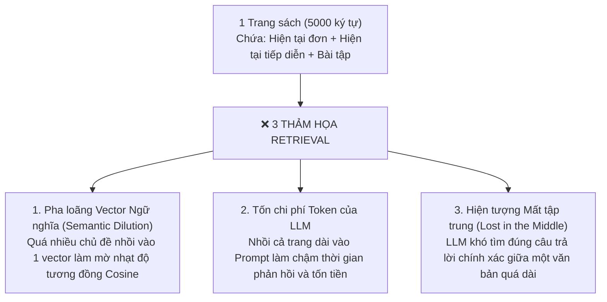
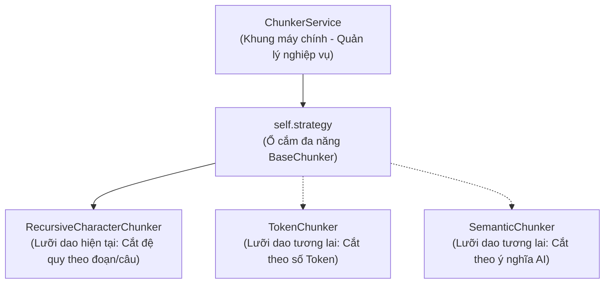
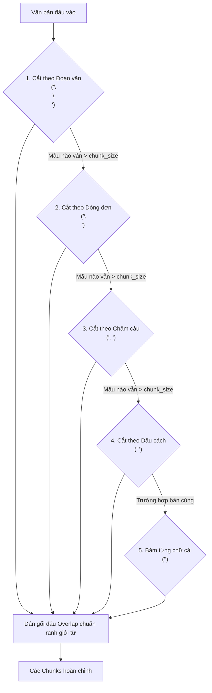

# 📘 NGÀY 3: CHUNKING SERVICE THEO NGỮ CẢNH HỌC TIẾNG ANH (STRATEGY PATTERN)

> **Dự án**: AI English Tutor RAG (14 Ngày)  
> **Trọng tâm Ngày 3**: Hiểu bản chất toán học và ngữ nghĩa của việc phân đoạn văn bản (Chunking) trong RAG; phân biệt rạch ròi giữa Vòng lặp (Iteration), Lồng nhau (Nesting) và Đệ quy (Recursion); làm chủ Strategy Pattern; giải quyết triệt để lỗi rách từ trong Overlap và bài toán ranh giới lật trang (Page Boundaries).

---

## 📑 MỤC LỤC
1. [Tại sao RAG bắt buộc phải Chunking?](#1-tại-sao-rag-bắt-buộc-phải-chunking)
2. [Thiết kế Kiến trúc: Strategy Pattern](#2-thiết-kế-kiến-trúc-strategy-pattern)
3. [Giải phẫu Thuật toán Recursive Character Chunking](#3-giải-phẫu-thuật-toán-recursive-character-chunking)
4. [Góc Code Review & Bắt lỗi: Những câu hỏi đào sâu cốt lõi](#4-góc-code-review--bắt-lỗi-những-câu-hỏi-đào-sâu-cốt-lõi)
5. [Từ điển các Hàm & Công cụ có sẵn của Thư viện](#5-từ-điển-các-hàm--công-cụ-có-sẵn-của-thư-viện)
6. [Kết quả Kiểm thử Thực tế & Chuẩn bị Ngày 4](#6-kết-quả-kiểm-thử-thực-tế--chuẩn-bị-ngày-4)

---

## 🎯 1. Tại sao RAG bắt buộc phải Chunking?

Ở Ngày 2, chúng ta đã trích xuất thành công văn bản theo **từng trang sách (Page-level)**. Tuy nhiên, một trang sách thường dài từ 3000 – 6000 ký tự và chứa nhiều chủ điểm ngữ pháp khác nhau. 

Nếu đưa nguyên một trang sách vào Vector Database, hệ thống sẽ gặp 3 thảm họa:



👉 **Chunking**: Là kỹ thuật băm trang sách thành các mẩu nhỏ (300 – 500 ký tự) vừa vặn, mỗi chunk chỉ tập trung giải thích **1 quy tắc ngữ pháp hoặc 1 ví dụ cụ thể**.

---

## 🏛️ 2. Thiết kế Kiến trúc: Strategy Pattern

Trong [src/services/chunker_service.py](file:///c:/Users/Nguyen%20Duc%20Vu%20Bao/Desktop/RAG/src/services/chunker_service.py), hệ thống áp dụng mẫu thiết kế **Strategy Pattern** theo chuẩn Enterprise:



### Tại sao mới có 1 thuật toán mà đã dựng sẵn Strategy Pattern?
* **Nguyên lý Open/Closed (SOLID)**: Hệ thống mở rộng tính năng mới thoải mái, nhưng đóng cửa không sửa code cũ.
* `ChunkerService` không bị gắn cứng vào bất kỳ thuật toán nào. Khi muốn đổi cách cắt, ta chỉ cần gọi:
  ```python
  chunk_service.set_strategy(NewStrategy())
  ```
  Toàn bộ các hàm nghiệp vụ khác không cần phải sửa lại một dòng code nào!

---

## ⚙️ 3. Giải phẫu Thuật toán Recursive Character Chunking

Thuật toán cắt đệ quy vận hành như một **Bộ rây lọc phân cấp từ lớn đến nhỏ**:



* **Thứ tự ưu tiên phân tách**: `["\n\n", "\n", ". ", " ", ""]`
  - Ưu tiên 1 (`\n\n`): Giữ trọn một đoạn văn bản (Quy tắc ngữ pháp).
  - Ưu tiên 2 (`\n`): Tách theo từng dòng nếu đoạn quá dài.
  - Ưu tiên 3 (`. `): Tách theo câu, **tuyệt đối không bẻ đôi một câu nói tiếng Anh**.
  - Ưu tiên 4 (` `): Tách theo từ ngữ, **không bẻ đôi một từ vựng**.
  - Ưu tiên 5 (`""`): Kế sách dự phòng khi gặp chuỗi ký tự dính liền không có dấu cách (URL).

---

## 🔍 4. Góc Code Review & Bắt lỗi: Những câu hỏi đào sâu cốt lõi

Dưới đây là bản tổng hợp các câu hỏi phản biện và bài học kiến trúc xuất sắc đã được mổ xẻ trong buổi học:

### 4.1. `separators[-1]` là dấu nào và tại sao lại dùng nó?
* Trong Python, chỉ số `[-1]` lấy phần tử cuối cùng của mảng $\rightarrow$ chính là **chuỗi rỗng `""`**.
* Đây là **phương án dự phòng cuối cùng (Fallback)**: Khi văn bản không có bất kỳ dấu phân cách nào (`\n\n`, `\n`, `. `, `" "`), vòng lặp sẽ giữ nguyên `separator = ""`.
* Kết hợp với dòng 72: `text.split(separator) if separator else list(text)`: Vì không thể `split("")`, lệnh `list(text)` sẽ chẻ văn bản thành từng ký tự đơn lẻ `['A', 'B', 'C']` để bảo đảm không bao giờ bị lỗi và không bao giờ vượt quá `chunk_size`.

---

### 4.2. Ý nghĩa 3 biến quản lý đóng gói: `chunks`, `current_chunk`, `current_length`
* **`chunks: List[str]`** *(Kho chứa)*: Chứa danh sách các thùng văn bản đã được đóng gói xong xuôi.
* **`current_chunk: List[str]`** *(Chiếc thùng đang mở)*: Nơi đang nhặt từng mẩu con (`piece`) bỏ vào dở dang.
* **`current_length: int`** *(Cái cân điện tử)*: Biến số nguyên cộng dồn số ký tự trong thùng đang mở, dùng để đối chiếu với `chunk_size` trước khi bỏ thêm mẩu mới vào.

---

### 4.3. Tại sao khi tính độ dài lại phải cộng cả dấu phân cách: `piece_len = len(piece) + len(separator)`?
* **Hiện tượng**: Lệnh `text.split(separator)` đã vứt bỏ dấu nối đi. Nhưng khi đóng gói, lệnh `separator.join(current_chunk)` sẽ **hàn lại các dấu nối vào giữa các mẩu**.
* **Nguy cơ**: Nếu không cộng trước `len(separator)`, khi nối lại chuỗi thực tế sẽ bị dài hơn dự tính và **làm tràn vượt quá `chunk_size`**!
* **`if current_chunk else 0`**: Mẩu đầu tiên bỏ vào thùng rỗng không cần móc nối phía trước nó nên cộng `0`.

---

### 4.4. Bản chất Đệ quy (Recursion) vs Lồng nhau (Nesting)
* **Khác biệt rạch ròi**:
  - `if-else` lồng nhau nhiều tầng: Chỉ là **Cây quyết định (Decision Tree)**, không phải đệ quy. Việc lồng nhau quá sâu bị gọi là *Arrow Anti-Pattern (Code mùi)*.
  - **Đệ quy thực sự**: Chỉ duy nhất diễn ra ở **dòng 90** (`sub_pieces = self._split_recursive(...)`) khi hàm tự gọi lại chính nó.
* **Tính tự đồng dạng (Self-Similarity)**:
  - Bạn đã phát hiện ra: Tầng to (`piece`) và tầng con (`sub_pieces`) làm **cùng một hành động đóng thùng y hệt nhau**.
  - 👉 Tư duy Clean Code: Có thể tách toàn bộ logic đóng thùng đó thành một hàm phụ trợ riêng `_add_piece()` để code phẳng và không bị lặp lại (nguyên lý DRY).

---

### 4.5. Lỗi rách từ trong Overlap và Định dạng tối ưu cho LLM
* **Lỗi ngây thơ ban đầu**: Cắt thô bạo `prev_chunk[-50:]` làm chém đứt đôi từ vựng (`"t have results..."`), chèn dấu `...` làm LLM bị ảo giác.
* **Cách khắc phục chuẩn Enterprise**:
  - Lùi lại đến **khoảng trắng gần nhất** để lấy trọn vẹn từ vựng.
  - Xóa bỏ hoàn toàn dấu `...` lem luốc.
  - Nối bằng dấu xuống dòng `\n` để văn bản chảy tự nhiên như sách in.

---

### 4.6. Chuyện gì xảy ra khi lật sang trang sách mới? (Page-boundary Trade-off)
* **Code hiện tại chạy theo cơ chế Page-by-Page**:
  - Băm độc lập từng trang một: Hết Trang 1 thì reset máy cắt, chuyển sang băm Trang 2.
  - `global_chunk_idx` tăng liên tục từ 0 đến N xuyên suốt cả cuốn sách.
* **Đánh đổi kiến trúc (Trade-off)**:
  - *Ưu điểm*: **Metadata số trang chuẩn xác 100%**, dễ trích dẫn nguồn cho học viên.
  - *Hạn chế*: Nếu một câu văn bị in vắt nửa ở cuối Trang 1 và nửa ở đầu Trang 2, câu đó sẽ không được gối đầu overlap qua ranh giới trang.

---

## 📖 5. Từ điển các Hàm & Công cụ có sẵn của Thư viện

| Công cụ có sẵn | Thuộc gói | Cú pháp gọi trong code | Công dụng & Bản chất kỹ thuật |
| :--- | :--- | :--- | :--- |
| **`ABC`** | `abc` | `class BaseChunker(ABC):` | Lớp trừu tượng (Abstract Base Class), đóng vai trò hợp đồng chuẩn trong Strategy Pattern. |
| **`@abstractmethod`** | `abc` | `@abstractmethod def split_text(...)` | Decorator ép buộc mọi class chiến lược con bắt buộc phải cài đặt phương thức này. |
| **`Optional[T]`** | `typing` | `strategy: Optional[BaseChunker] = None` | Type hint quy định tham số có thể là đối tượng kiểu `T` hoặc giá trị `None`. |
| **`str.split(sep)`** | Built-in | `text.split(separator)` | Chẻ chuỗi thành danh sách các chuỗi con theo dấu phân cách. |
| **`str.join(list)`** | Built-in | `separator.join(current_chunk)` | Dán các phần tử trong danh sách lại thành một chuỗi duy nhất, chèn `separator` vào giữa. |
| **`str.find(sub)`** | Built-in | `raw_overlap.find(" ")` | Tìm vị trí index đầu tiên của chuỗi con. Trả về `-1` nếu không tìm thấy. |
| **`list.index(x)`** | Built-in | `separators.index(separator)` | Trả về vị trí của phần tử trong danh sách, dùng để lấy các dấu nhỏ hơn tiếp theo (`[idx + 1 :]`). |
| **Slice `[-N :]`** | Built-in | `prev_chunk[-self.chunk_overlap :]` | Lấy ra $N$ ký tự cuối cùng của chuỗi văn bản (đếm ngược từ phải sang trái). |

---

## 🧪 6. Kết quả Kiểm thử Thực tế & Chuẩn bị Ngày 4

### 6.1. Kết quả thực nghiệm
Khi chạy `python test/test_chunker_service.py`:
- ✅ **Test 1**: Băm bài học mẫu 369 ký tự thành 3 chunk gối đầu liền mạch, không rách từ.
- ✅ **Test 2**: Đọc trực tiếp 2 trang sách PDF từ `DocumentService` (Ngày 2) $\rightarrow$ sinh ra **29 chunks chuẩn hóa** (mỗi chunk ~450 ký tự), gắn đầy đủ metadata nguồn gốc và số trang.

### 6.2. Cầu nối sang Ngày 4 (Bản chất Vector Similarity & Tìm kiếm ngữ nghĩa)
* Hiện tại chúng ta đã có hàng trăm đoạn **Chunks văn bản sạch sẽ**.
* Nhưng máy tính không hiểu được tiếng Anh hay chữ viết. Nó chỉ hiểu được các con số!
* 👉 **Ngày 4**: Chúng ta sẽ tìm hiểu **Bản chất toán học của Vector Không gian (Vector Space)**, tự tay viết thuật toán **Cosine Similarity và Dot Product bằng NumPy thuần** để xếp hạng và tìm kiếm những đoạn văn bản liên quan nhất với câu hỏi của học viên!
