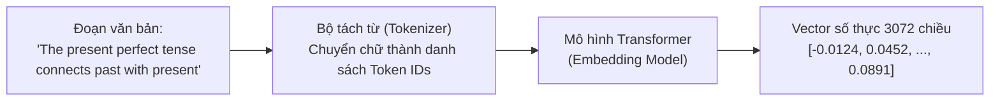

# 📘 NGÀY 4: BẢN CHẤT VECTOR SIMILARITY & TOÁN HỌC TRONG AI SEARCH

> **Dự án**: AI English Tutor RAG (14 Ngày)  
> **Trọng tâm Ngày 4**: Hiểu bản chất vật lý và toán học của việc biến câu văn thành vector số; tự tay viết thuật toán Cosine Similarity và ma trận hóa tìm kiếm bằng NumPy thuần; đào sâu cơ chế huấn luyện mô hình Embedding (Self-supervised Learning, Tokenization, không gian tiềm ẩn); giải phẫu tìm kiếm ngữ nghĩa đa ngữ (Cross-lingual) và kiến trúc OOP Singleton Pattern trong `EmbeddingService`.

---

## 📑 MỤC LỤC
1. [Bản chất Toán học: Tại sao biến câu văn thành Vector được?](#1-bản-chất-toán-học-tại-sao-biến-câu-văn-thành-vector-được)
2. [Cơ chế Huấn luyện mô hình Embedding](#2-cơ-chế-huấn-luyện-mô-hình-embedding)
3. [Ý nghĩa của các Chiều (Dimensions) trong Vector](#3-ý-nghĩa-của-các-chiều-dimensions-trong-vector)
4. [Toán học Cosine Similarity & Tìm kiếm Ma trận](#4-toán-học-cosine-similarity--tìm-kiếm-ma-trận)
5. [Tại sao dùng NumPy thay vì PyTorch?](#5-tại-sao-dùng-numpy-thay-vì-pytorch)
6. [Thực chiến: Giải phẫu `test_similarity.py` & Cơ chế Tìm kiếm](#6-thực-chiến-giải-phẫu-test_similaritypy--cơ-chế-tìm-kiếm)
7. [Code Review sâu: Singleton Pattern trong `EmbeddingService`](#7-code-review-sâu-singleton-pattern-trong-embeddingservice)
8. [Từ điển các Hàm & Công cụ có sẵn của Thư viện](#8-từ-điển-các-hàm--công-cụ-có-sẵn-của-thư-viện)
9. [Kết quả Kiểm thử Thực tế & Chuẩn bị Ngày 5](#9-kết-quả-kiểm-thử-thực-tế--chuẩn-bị-ngày-5)

---

## 🎯 1. Bản chất Toán học: Tại sao biến câu văn thành Vector được?

### ❓ Câu hỏi: *"Tại sao có thể biến câu văn thành các vector số thực?"*

Máy tính và mạng nơ-ron không có khái niệm về "chữ cái" hay "ngôn ngữ con người". Chúng chỉ có thể tính toán trên các con số. Vì vậy, ta cần một phương pháp ánh xạ ngôn ngữ tự nhiên vào **Không gian Vector Ngữ nghĩa (Semantic Vector Space)**.

#### Bản đồ ngữ nghĩa đa chiều:
- Mỗi câu văn hoặc đoạn văn được biểu diễn bằng một tọa độ trong không gian $D$ chiều (ví dụ với `gemini-embedding-001`, $D = 3072$).
- Những câu có **ý nghĩa tương đồng** sẽ có góc lệch rất nhỏ và nằm **gần nhau**.
- Những câu **không liên quan hoặc đối lập** sẽ nằm ở hướng khác và **xa nhau**.



---

## 🤖 2. Cơ chế Huấn luyện mô hình Embedding

### ❓ Câu hỏi 1: *"Tôi biết là nó đo rồi, nhưng đang hỏi là người ta gán nhãn sao hết được các từ?"*
> **Bản chất**: **Không có con người nào ngồi gán nhãn hàng triệu từ hay hàng tỷ câu cả!**

Mô hình học theo phương pháp **Self-supervised Learning (Học tự giám sát)**:
1. **Dữ liệu thô khổng lồ**: Thu thập hàng tỷ trang web, sách, báo chí (không cần nhãn dán).
2. **Cơ chế Masked Language Modeling (MLM)**:
   - Câu gốc: `"The present perfect tense is used for life experiences."`
   - Thuật toán tự động che ngẫu nhiên một số từ: `"The present perfect tense is used for life [MASK]."`
   - Mô hình đoán từ bị che. Nếu đoán sai, thuật toán tính đạo hàm sai số (Loss) và tự cập nhật trọng số (Backpropagation).
3. **Cơ chế Contrastive Learning (Học đối chiếu)**:
   - Đưa vào cặp câu cùng nghĩa: Kéo 2 vector lại gần nhau.
   - Đưa vào cặp câu khác nghĩa: Đẩy 2 vector ra xa nhau.

### ❓ Câu hỏi 2: *"Thế mỗi lần che thì bao giờ mới che được? (Bao giờ mới học xong?)"*
- Quá trình này được **song song hóa cực lớn** trên hàng ngàn chip TPU/GPU chuyên dụng.
- Thay vì che từng từ một, mô hình xử lý hàng chục ngàn câu cùng một chu kỳ xung nhịp.
- Quá trình huấn luyện kéo dài nhiều tuần/tháng với chi phí hàng triệu USD do các tập đoàn lớn (Google, OpenAI) thực hiện. Chúng ta sử dụng lại kết quả (Pre-trained Embeddings) qua API.

### ❓ Câu hỏi 3: *"Ví dụ như tiếng Việt có từ ghép thì sao? Sao các mô hình đó train được?"*
- Các mô hình hiện đại không tách từ theo khoảng trắng hay từ điển đơn thuần, mà dùng thuật toán **Subword Tokenization (BPE - Byte Pair Encoding hoặc WordPiece)**:
  - Nếu gặp từ ghép như `"kinh nghiệm"`, `"hoa hồng"`, nếu cụm này xuất hiện nhiều lần cùng nhau, tokenizer sẽ gộp nó thành một token duy nhất.
  - Nếu gặp từ mới lạ, nó tự rã thành các mẩu nhỏ (subwords) hoặc từng byte ký tự.
  - Nhờ vậy, mô hình xử lý mượt mà cả tiếng Việt có dấu, từ ghép, tiếng Đức (từ ghép cực dài) hay chữ tượng hình tiếng Trung/Nhật.

---

## 🔢 3. Ý nghĩa của các Chiều (Dimensions) trong Vector

### ❓ Câu hỏi: *"Nếu có chiều nhiều thế thì bình thường nó là feature nào?"*

- Trong Machine Learning truyền thống, con người tự gán nhãn feature: `chiều 1: độ dài`, `chiều 2: số danh từ`...
- Nhưng trong Deep Learning, 3072 chiều là **Không gian đặc trưng tiềm ẩn (Latent Features)** do mô hình tự trừu tượng hóa. Con người không thể đặt tên rạch ròi cho từng chiều đơn lẻ.
- Tuy nhiên, các chiều phối hợp cùng nhau để mã hóa các thông tin phức tạp:
  - **Khía cạnh cú pháp**: Cấu trúc ngữ pháp, thì thời gian (hiện tại / quá khứ / tương lai).
  - **Khía cạnh thực thể & chủ đề**: Giáo dục, sinh học, công nghệ, con người...
  - **Sắc thái biểu cảm & ngữ cảnh**: Trang trọng, thân mật, khẳng định, phủ định.

---

## 📐 4. Toán học Cosine Similarity & Tìm kiếm Ma trận

### 4.1. Định nghĩa và Công thức Toán học

$$\text{Cosine Similarity}(u, v) = \frac{u \cdot v}{\|u\| \|v\|} = \frac{\sum_{i=1}^n u_i v_i}{\sqrt{\sum_{i=1}^n u_i^2} \sqrt{\sum_{i=1}^n v_i^2}}$$

- $u \cdot v$: Tích vô hướng (Dot Product).
- $\|u\|$: Độ dài hình học (Chuẩn L2 - Norm) của vector.
- Kết quả luôn nằm trong đoạn $[-1.0, 1.0]$:
  - **1.0**: Hai vector cùng hướng hoàn toàn ($\theta = 0^\circ$) $\rightarrow$ Đồng nghĩa tuyệt đối.
  - **0.0**: Hai vector vuông góc nhau ($\theta = 90^\circ$) $\rightarrow$ Hoàn toàn không liên quan.
  - **-1.0**: Hai vector ngược hướng nhau ($\theta = 180^\circ$) $\rightarrow$ Ý nghĩa đối lập.

### 4.2. Tại sao dùng Cosine thay vì Khoảng cách Euclid (L2 Distance)?
- **Khoảng cách Euclid** bị ảnh hưởng mạnh bởi **độ dài văn bản** (câu dài chứa nhiều từ sẽ có vector độ lớn lớn hơn, làm khoảng cách bị dãn ra dù cùng chủ đề).
- **Cosine Similarity** chỉ quan tâm đến **góc lệch hướng (direction)** của ngữ nghĩa, loại bỏ hoàn toàn sự chênh lệch về độ dài câu.

### 4.3. Tối ưu Ma trận hóa (Vectorization) bằng NumPy
Khi có 1 câu hỏi ($1 \times D$) và $N$ đoạn văn bản ($N \times D$), thay vì dùng vòng lặp `for` chậm chạp, ta chuẩn hóa ma trận rồi nhân 1 lần:

```python
def matrix_cosine_similarity(query_vec: np.ndarray, doc_matrix: np.ndarray) -> np.ndarray:
    # 1. Chuẩn hóa query vector về độ dài 1
    q_norm = query_vec / np.linalg.norm(query_vec)
    # 2. Chuẩn hóa từng hàng của ma trận tài liệu về độ dài 1
    doc_norms = doc_matrix / np.linalg.norm(doc_matrix, axis=1, keepdims=True)
    # 3. Nhân ma trận: [N, D] x [D] = [N] điểm số
    return np.dot(doc_norms, q_norm)
```
> **Tốc độ**: Nhanh hơn vòng lặp Python từ **100 đến 1000 lần** nhờ tập lệnh SIMD của C/Fortran chạy dưới nền CPU.

---

## ⚖️ 5. Tại sao dùng NumPy thay vì PyTorch?

### ❓ Câu hỏi: *"Tại sao không dùng PyTorch hay 1 số thư viện khác ngoài NumPy?"*

1. **Độ nhẹ và Đơn giản (Lightweight)**:
   - `numpy` chỉ chiếm ~30MB dung lượng, cài đặt tức thì.
   - `pytorch` nặng từ 800MB đến 2GB (kèm CUDA driver), thừa thãi khi chỉ cần tính toán đại số tuyến tính cơ bản trên CPU.
2. **Không cần Gradient / Backpropagation**:
   - PyTorch mạnh ở việc tính đạo hàm tự động để train model. Ở bước Retrieval này, ta chỉ cần nhân ma trận inference để xếp hạng điểm số.
3. **Hiểu sâu bản chất**:
   - Tự viết bằng NumPy giúp lập trình viên hiểu tường tận từng phép toán $u \cdot v$ và căn bậc hai của tổng bình phương, thay vì phụ thuộc vào các hàm "hộp đen".

---

## 🔬 6. Thực chiến: Giải phẫu `test_similarity.py` & Cơ chế Tìm kiếm

### ❓ Câu hỏi 1: *"Test 2 là mình prompt cho AI tìm à?"*
> **Hiểu đúng**: **Không phải prompt cho AI tìm!**
- **Google Gemini** chỉ nhận câu chữ và trả về **chuỗi số (vector 3072 chiều)**.
- Việc so sánh câu hỏi gần với đoạn văn nào nhất, tính điểm số ra sao, sắp xếp Top-k từ cao xuống thấp là do **chính mã nguồn Python & NumPy của chúng ta tự tính**.

### ❓ Câu hỏi 2: *"Sao test nó lại đưa kết quả bằng tiếng Anh? Nếu mình hỏi bằng tiếng Việt có đưa ra kết quả tiếng Việt không và tại sao lại thế?"*
- **Cross-lingual Semantic Search (Tìm kiếm đa ngữ)**: Mô hình `gemini-embedding-001` là mô hình đa ngữ (Multilingual).
- Khi bạn hỏi: *"Thì hiện tại hoàn thành dùng như thế nào?"* (Tiếng Việt) và tài liệu trong sách là *"The present perfect tense connects past with present"* (Tiếng Anh):
  - Do mô hình đã học được mối tương quan giữa các ngôn ngữ, hai câu này sẽ được chiếu vào **cùng một vùng tọa độ** trong không gian 3072 chiều!
  - Thuật toán Cosine của bạn vẫn tính ra điểm số cao ngất ngưởng và tìm ra đúng đoạn sách tiếng Anh liên quan.

### ❓ Câu hỏi 3: *"Tức là bạn chưa lấy dữ liệu chunking mà chỉ giả lập doc thôi à?"*
- **Chính xác!** File `test/test_similarity.py` dùng 4 đoạn văn bản giả lập (mock documents) nhằm:
  - Kiểm thử độc lập và chứng minh thuật toán toán học hoạt động đúng 100% trước khi ghép vào hệ thống lớn.
  - Tránh phụ thuộc vào file PDF thật hay tốc độ load dữ liệu.
  - Sang **Ngày 5**, ta sẽ đem toàn bộ chunks thật từ `ChunkerService` nạp vào **ChromaDB**.

---

## 🏛️ 7. Code Review sâu: Singleton Pattern trong `EmbeddingService`

Trong file [src/services/embedding_service.py](file:///c:/Users/Nguyen%20Duc%20Vu%20Bao/Desktop/RAG/src/services/embedding_service.py):

```python
class EmbeddingService:
    _instance: Optional["EmbeddingService"] = None
    _client: Optional[genai.Client] = None

    def __new__(cls) -> "EmbeddingService":
        if cls._instance is None:
            cls._instance = super(EmbeddingService, cls).__new__(cls)
            api_key = os.getenv("GEMINI_API_KEY")
            if not api_key:
                ...
            cls._client = genai.Client(api_key=api_key)
            logger.info("Khởi tạo thành công Gemini Client Singleton cho EmbeddingService.")
        return cls._instance
```

### ❓ 7.1. `cls` là gì? Khác gì với `self`?
- **`self`**: Đại diện cho **đối tượng cụ thể (Instance)** được tạo ra từ class. Dùng trong các hàm thông thường (`__init__`, `embed_text`).
- **`cls`**: Đại diện cho **bản thân Lớp (Class)**. Dùng trong hàm `__new__` hoặc `@classmethod` khi đối tượng thực tế chưa hề được tạo ra.

### ❓ 7.2. Ý nghĩa của `_instance` và `_client` ở đầu class?
- Đây là **Class Variables (Biến cấp lớp)**, tồn tại duy nhất 1 bản trong bộ nhớ và được chia sẻ cho toàn bộ chương trình:
  - `_instance`: Lưu vết xem đối tượng `EmbeddingService` đã từng được sinh ra hay chưa.
  - `_client`: Lưu kết nối kết nối mạng duy nhất tới Google GenAI SDK.
  - Dấu gạch dưới `_` ở đầu: Báo hiệu quy ước biến nội bộ (private).

### ❓ 7.3. `cls._instance = super(EmbeddingService, cls).__new__(cls)` - Chỗ này nghĩa là gì?
- **`__new__`**: Là phương thức chịu trách nhiệm **cấp phát vùng nhớ thực sự** cho một đối tượng (chạy trước cả `__init__`).
- **`super(EmbeddingService, cls)`**: Tìm lên lớp cha cao nhất của mọi class trong Python: lớp **`object`**.
- Lệnh này mang ý nghĩa: *"Nhờ lớp cha `object` cấp phát một ô nhớ sạch sẽ cho lớp `cls` này, rồi gán ô nhớ đó vào `cls._instance`"*.

### ❓ 7.4. Nghĩa là coi cái ý ngoài lớp EmbeddingService đúng không?
- Đúng, ta phải nhờ tầng tổ tiên `object` sinh ra vùng nhớ gốc, chứ bản thân `EmbeddingService` không tự bốc hơi ra vùng nhớ của chính nó được.

### ❓ 7.5. "Nếu gọi kiểu kia (gọi sai) thì sẽ bị sao?"
- **Trường hợp gọi sai 1 (Đệ quy vô tận)**: Nếu viết `cls._instance = EmbeddingService()`, Python lại nhảy vào `__new__` $\rightarrow$ lại gọi `EmbeddingService()` $\rightarrow$ văng lỗi **`RecursionError: maximum recursion depth exceeded`**.
- **Trường hợp gọi sai 2 (Không dùng Singleton)**: Mỗi lần một hàm cần embed một câu lại khởi tạo `genai.Client()`. Khi xử lý 1 cuốn sách có 1000 chunks, hệ thống sẽ mở 1000 phiên kết nối HTTPS $\rightarrow$ làm tràn bộ nhớ (Memory Leak), chậm kết nối mạng và dễ bị Google khóa API vì spam connection.

---

## 📖 8. Từ điển các Hàm & Công cụ có sẵn của Thư viện

| Thư viện / Công cụ | Cú pháp sử dụng | Công dụng kỹ thuật |
| :--- | :--- | :--- |
| **NumPy** | `np.dot(vec1, vec2)` | Tính tích vô hướng (Dot Product) của 2 vector. |
| **NumPy** | `np.linalg.norm(vec)` | Tính độ dài hình học (Euclidean L2 norm) của vector. |
| **NumPy** | `np.linalg.norm(mat, axis=1, keepdims=True)` | Tính độ dài theo từng hàng của ma trận và giữ nguyên số chiều để chia tỉ lệ (Broadcasting). |
| **NumPy** | `np.argsort(scores)[::-1]` | Lấy danh sách chỉ số (index) sắp xếp theo thứ tự điểm giảm dần. |
| **NumPy** | `np.isclose(a, b)` | Kiểm tra 2 số thực có bằng nhau không (với sai số chấp nhận được $10^{-5}$ để tránh lỗi làm tròn dấu phẩy động). |
| **Google GenAI** | `genai.Client(api_key=...)` | Khởi tạo client kết nối tới hệ sinh thái Google AI. |
| **Google GenAI** | `client.models.embed_content(...)` | Gửi request nhúng văn bản tới model `gemini-embedding-001`. |
| **Python OOP** | `__new__(cls)` | Magic method cấp phát bộ nhớ cho instance (nền tảng của Singleton). |
| **Python OOP** | `super(Child, cls).__new__(cls)` | Gọi hàm cấp phát vùng nhớ từ lớp cha `object`. |

---

## 🧪 9. Kết quả Kiểm thử Thực tế & Chuẩn bị Ngày 5

### 9.1. Kết quả kiểm thử (`test/test_similarity.py`)
- ✅ **Test 1**: Chứng minh định luật toán học:
  - Cùng hướng: $\text{Cosine} = 1.0000$
  - Vuông góc: $\text{Cosine} = 0.0000$
  - Ngược hướng: $\text{Cosine} = -1.0000$
- ✅ **Test 2**: Semantic Search thực tế:
  - Câu hỏi: *"How do I use have and has with V3 to talk about life experience?"*
  - Đoạn 1 (Thì hiện tại hoàn thành): **Top 1 với điểm số cao nhất (~0.85)**.
  - Đoạn 4 (Quang hợp ở thực vật): **Điểm thấp nhất (~0.20)**.

### 9.2. Bước đệm sang Ngày 5
- **Điểm yếu Ngày 4**: Vector chỉ nằm tạm trong RAM, tắt máy là mất. Phải tính toán ma trận thủ công.
- **Nhiệm vụ Ngày 5**: Đóng gói tầng lưu trữ với **ChromaDB (Vector Database)** theo mẫu **Repository Pattern**:
  - Tự động lưu vector vĩnh viễn xuống ổ đĩa (`PersistentClient`).
  - Hỗ trợ lọc theo Metadata (`book_title`, `page_number`).
  - Tích hợp trọn vẹn từ khâu Ingest dữ liệu sách PDF đến khâu Query Top-k.
