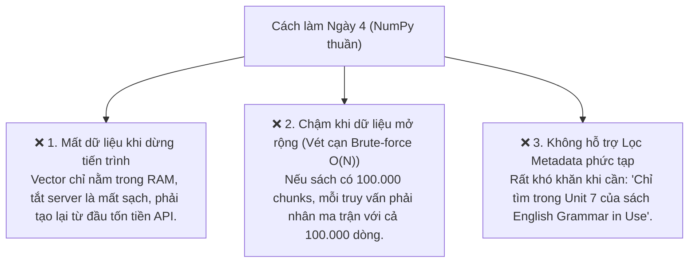

# 📘 NGÀY 5: VECTOR STORE REPOSITORY (TÍCH HỢP CHROMADB)

> **Dự án**: AI English Tutor RAG (14 Ngày)  
> **Trọng tâm Ngày 5**: Xây dựng tầng lưu trữ Vector Database bền vững sử dụng **ChromaDB** theo mẫu thiết kế **Repository Pattern** chuẩn Enterprise; tìm hiểu kiến trúc lưu trữ lai (Hybrid Storage: SQLite + HNSW Binary Files); tối ưu hóa tìm kiếm Top-k kết hợp bộ lọc Metadata đa tầng; kiểm chứng tính bền vững (Persistence) và bảo toàn dữ liệu khi khởi động lại ứng dụng.

---

## 📑 MỤC LỤC
1. [Tại sao cần Vector Database chuyên dụng thay vì NumPy?](#1-tại-sao-cần-vector-database-chuyên-dụng-thay-vì-numpy)
2. [Cơ chế Lưu trữ Ổ cứng của ChromaDB (Hybrid Storage Architecture)](#2-cơ-chế-lưu-trữ-ổ-cứng-của-chromadb-hybrid-storage-architecture)
3. [Thiết kế Kiến trúc: Repository Pattern](#3-thiết-kế-kiến-trúc-repository-pattern)
4. [Giải phẫu Chi tiết Mã Nguồn Vector Store](#4-giải-phẫu-chi-tiết-mã-nguồn-vector-store)
   - [4.1. Hợp đồng trừu tượng: `BaseVectorStore`](#41-hợp-đồng-trừu-tượng-basevectorstore)
   - [4.2. Thực thi cụ thể: `ChromaVectorStore`](#42-thực-thi-cụ-thể-chromavectorstore)
5. [Từ điển các Hàm & Công cụ có sẵn của Thư viện ChromaDB](#5-từ-điển-các-hàm--công-cụ-có-sẵn-của-thư-viện-chromadb)
6. [Kết quả Kiểm thử Thực tế & Cầu nối sang Ngày 6](#6-kết-quả-kiểm-thử-thực-tế--cầu-nối-sang-ngày-6)

---

## 🎯 1. Tại sao cần Vector Database chuyên dụng thay vì NumPy?

Ở Ngày 4, chúng ta đã tự tay viết thuật toán **Cosine Similarity** bằng NumPy và xếp hạng kết quả chính xác 100%. Tuy nhiên, cách tiếp cận đó chỉ phù hợp để nghiên cứu bản chất toán học vì gặp phải **3 rào cản lớn trong Production**:



👉 **ChromaDB** sinh ra để giải quyết triệt để 3 rào cản trên bằng cách:
1. **Lưu trữ bền vững (Persistence)** xuống đĩa cứng (chỉ embed sách 1 lần duy nhất).
2. **Tăng tốc tìm kiếm qua cấu trúc Đồ thị HNSW** (Approximate Nearest Neighbors - ANN) với độ phức tạp $O(\log N)$.
3. **Quản lý dữ liệu đi kèm (Metadata Filtering)** hỗ trợ toán tử SQL linh hoạt (`$eq`, `$in`, `$gt`...).

---

## 💾 2. Cơ chế Lưu trữ Ổ cứng của ChromaDB (Hybrid Storage Architecture)

Khi cấu hình `chromadb.PersistentClient(path="./chroma_data")`, ChromaDB không lưu thành file JSON hay văn bản thô, mà sử dụng **Kiến trúc Lai (Hybrid Storage)**:

```text
chroma_data/
├── chroma.sqlite3                  <--- 1. CSDL SQLite (Lưu Text, ID, Metadata & Trạng thái ACID)
└── <collection-uuid>/              <--- 2. Thư mục chứa File Nhị phân HNSW (Lưu Vector & Đồ thị)
    ├── data_level0.bin             <--- Mạng lưới liên kết vector dạng byte thô
    ├── header.bin                  <--- Cấu hình số chiều (3072) và độ dài index
    └── length.bin
```

### 2.1. Tầng Quan hệ: `chroma.sqlite3`
- Quản lý toàn bộ thông tin có cấu trúc: Tên bộ sưu tập (`collection`), danh sách ID, nội dung văn bản gốc (`document`) và metadata số trang/tên sách.
- Hỗ trợ chuẩn **ACID** (chống hỏng dữ liệu khi mất điện) và cơ chế ghi nhật ký giao dịch **WAL (Write-Ahead Logging)**.

### 2.2. Tầng Không gian: Các file nhị phân HNSW (`.bin`)
- Lưu trữ hàng triệu tọa độ vector 3072 chiều.
- Dùng cơ chế **Ánh xạ bộ nhớ (Memory-Mapped Files - `mmap`)**: Hệ điều hành chỉ nạp các phân đoạn vector cần so khớp vào RAM thay vì đọc toàn bộ file, giúp ứng dụng tiết kiệm RAM và khởi động tức thì.

---

## 🏛️ 3. Thiết kế Kiến trúc: Repository Pattern

```mermaid
flowchart TD
    subgraph Business ["Tầng Nghiệp vụ (Business Layer)"]
        TutorRAG["RAGService / EnglishTutorFacade"]
    end

    subgraph Interface ["Tầng Trừu tượng (Contract Layer)"]
        BaseRepo["<<Interface>> BaseVectorStore\n(+add_documents, +similarity_search, +count)"]
    end

    subgraph Concrete ["Tầng Thực thi (Concrete Repository)"]
        ChromaStore["ChromaVectorStore\n(Sử dụng ChromaDB - Hiện tại)"]
        QdrantStore["QdrantVectorStore\n(Mở rộng tương lai)"]
        PineconeStore["PineconeVectorStore\n(Mở rộng Cloud tương lai)"]
    end

    subgraph Storage ["Tầng Đĩa cứng (Disk Persistence)"]
        DiskStore[("chroma_data/ (SQLite3 + HNSW Binary)")]
    end

    TutorRAG --> BaseRepo
    BaseRepo <|-- ChromaStore
    BaseRepo <|-.-> QdrantStore
    BaseRepo <|-.-> PineconeStore
    ChromaStore --> DiskStore
```

### Lợi ích chuẩn Enterprise:
1. **Loose Coupling (Giảm sự phụ thuộc)**: Tầng nghiệp vụ không import trực tiếp `chromadb`. Nếu sau này công ty yêu cầu chuyển sang Qdrant hoặc Pinecone, chỉ cần viết một class mới kế thừa `BaseVectorStore` mà không phải sửa một dòng code nào trong `RAGService`.
2. **Testability (Dễ kiểm thử)**: Khi viết Unit Test cho tầng Business, ta có thể inject một Mock Vector Store mà không cần phải chạy cơ sở dữ liệu thật.

---

## 🔍 4. Giải phẫu Chi tiết Mã Nguồn Vector Store

### 4.1. Hợp đồng trừu tượng: [`src/vector_store/base.py`](file:///c:/Users/Nguyen%20Duc%20Vu%20Bao/Desktop/RAG/src/vector_store/base.py)

```python
from abc import ABC, abstractmethod
from typing import Any, Dict, List, Optional

class BaseVectorStore(ABC):
    @abstractmethod
    def add_documents(
        self,
        documents: List[str],
        metadatas: Optional[List[Dict[str, Any]]] = None,
        ids: Optional[List[str]] = None,
    ) -> List[str]:
        """Lưu trữ danh sách các đoạn văn bản (chunks) và metadata."""
        pass

    @abstractmethod
    def similarity_search(
        self,
        query: str,
        top_k: int = 3,
        where: Optional[Dict[str, Any]] = None,
    ) -> List[Dict[str, Any]]:
        """Tìm kiếm Top-k đoạn văn bản có độ tương đồng ngữ nghĩa cao nhất."""
        pass

    @abstractmethod
    def count(self) -> int:
        """Đếm tổng số lượng bản ghi trong kho."""
        pass

    @abstractmethod
    def reset(self) -> None:
        """Xóa sạch bộ sưu tập."""
        pass
```

---

### 4.2. Thực thi cụ thể: [`src/vector_store/chroma_store.py`](file:///c:/Users/Nguyen%20Duc%20Vu%20Bao/Desktop/RAG/src/vector_store/chroma_store.py)

#### Điểm sáng kỹ thuật:
1. **Dependency Injection & Singleton**:
   ```python
   self.embedding_service = embedding_service or EmbeddingService()
   ```
   Tự động tái sử dụng `EmbeddingService` Singleton đã viết ở Ngày 4, duy trì 1 client kết nối duy nhất tới Gemini API.
2. **Không gian Khoảng cách Cosine (`hnsw:space = cosine`)**:
   ```python
   self.collection = self.client.get_or_create_collection(
       name=self.collection_name,
       metadata={"hnsw:space": "cosine"},
   )
   ```
   Mặc định ChromaDB dùng $L2$ squared. Thiết lập `"hnsw:space": "cosine"` giúp chuẩn hóa việc so khớp góc lệch ngữ nghĩa.
3. **Quy đổi Khoảng cách sang Điểm tương đồng**:
   ```python
   # Trong không gian Cosine: Cosine Distance = 1 - Cosine Similarity
   score = max(0.0, 1.0 - dist)
   ```
   Chuyển đổi `distance` của ChromaDB thành `score` trực quan (trong khoảng $[0.0, 1.0]$, điểm càng cao càng liên quan).

---

## 📖 5. Từ điển các Hàm & Công cụ có sẵn của Thư viện ChromaDB

| Hàm / Thuộc tính | Cú pháp sử dụng | Công dụng & Bản chất kỹ thuật |
| :--- | :--- | :--- |
| **`chromadb.PersistentClient`** | `client = chromadb.PersistentClient(path="./data")` | Khởi tạo kết nối lưu trữ bền vững xuống thư mục cục bộ (tự động tạo SQLite và cấu trúc file index). |
| **`get_or_create_collection`** | `client.get_or_create_collection(name, metadata=...)` | Lấy collection nếu đã có, hoặc tạo mới nếu chưa tồn tại (tương tự `CREATE TABLE IF NOT EXISTS`). |
| **`collection.add`** | `collection.add(ids=..., embeddings=..., documents=..., metadatas=...)` | Nạp đồng thời cả 4 thành phần: mã định danh, vector nhúng, văn bản gốc và thẻ thông tin metadata. |
| **`collection.query`** | `collection.query(query_embeddings=..., n_results=3, where=...)` | Thực hiện tìm kiếm vector láng giềng gần nhất (ANN qua HNSW) kết hợp bộ lọc metadata (`where`). |
| **`collection.count`** | `collection.count()` | Trả về tổng số lượng bản ghi (vector) hiện có trong collection. |
| **`client.delete_collection`** | `client.delete_collection(name=...)` | Xóa sổ hoàn toàn một collection và giải phóng tài nguyên đĩa cứng. |
| **`uuid.uuid4().hex`** | `f"chunk_{uuid.uuid4().hex[:10]}"` | Sinh chuỗi mã định danh ngẫu nhiên chuẩn 128-bit không trùng lặp cho từng chunk văn bản. |

---

## 🧪 6. Kết quả Kiểm thử Thực tế & Cầu nối sang Ngày 6

Kịch bản kiểm thử toàn diện tại [`test/test_chroma_store.py`](file:///c:/Users/Nguyen%20Duc%20Vu%20Bao/Desktop/RAG/test/test_chroma_store.py) đã chạy và vượt qua **4/4 bài kiểm thử**:

```text
=====================================================================
🚀 BẮT ĐẦU KIỂM THỬ TOÀN DIỆN CHROMADB VECTOR STORE (NGÀY 5)
=====================================================================

--- BÀI TEST 1: KHỞI TẠO VÀ THÊM DỮ LIỆU VÀO CHROMADB ---
[INFO] - Đang tạo vector embedding cho 5 chunks...
[INFO] - Đã lưu thành công 5 chunks vào ChromaDB.
[INFO] - Tổng số bản ghi trong ChromaDB hiện tại: 5
✅ Bài test 1: Ingestion và Count thành công 100%!

--- BÀI TEST 2: TRUY VẤN NGỮ NGHĨA TOP-K BẰNG CÂU HỎI TỰ NHIÊN ---
[INFO] - Câu hỏi của học viên: 'How to talk about things I have experienced in my life?'
[INFO] - Top 1 | Điểm tương đồng: 0.6337 (Distance: 0.3663)
         Nguồn: [English Grammar in Use - Trang 14]
         Nội dung: "The present perfect tense is formed with have/has + past participle (V3)..."
✅ Bài test 2: Semantic Search xếp hạng chính xác 100%!

--- BÀI TEST 3: TÌM KIẾM KẾT HỢP BỘ LỌC METADATA ---
[INFO] - Câu hỏi: 'How to use past participle V3?' với điều kiện: {'book_title': 'Oxford Practice Grammar'}
[INFO] - Top 1 | Sách: Oxford Practice Grammar | Điểm: 0.7698
         Nội dung: "Passive voice is formed with 'be' + past participle (V3)..."
✅ Bài test 3: Metadata Filtering hoạt động chính xác tuyệt đối!

--- BÀI TEST 4: KIỂM CHỨNG LƯU TRỮ BỀN VỮNG XUỐNG Ổ CỨNG ---
[INFO] - Giả lập tắt ứng dụng và khởi động lại Client mới kết nối vào thư mục...
[INFO] - Số lượng bản ghi tự động nạp từ ổ cứng: 5
[INFO] - Kết quả truy vấn tức thì từ đĩa: "Use 'since' with a specific point in time..."
✅ Bài test 4: Tính bền vững (Persistence) hoạt động hoàn hảo!

🎉 TOÀN BỘ 4 BÀI TEST ĐÃ VƯỢT QUA XUẤT SẮC!
```

---

### 🚀 Cầu nối sang Ngày 6 (Xây dựng RAG Engine & Grounded Prompting)
- **Đã hoàn thành**: Đến Ngày 5, chúng ta đã có đủ 3 mảnh ghép nền tảng độc lập:
  1. `DocumentService`: Đọc & trích xuất PDF tiếng Anh.
  2. `ChunkerService`: Băm nhỏ văn bản kèm metadata.
  3. `ChromaVectorStore`: Lưu trữ vector bền vững và tìm kiếm Top-k siêu tốc.
- **Mục tiêu Ngày 6**: Nối toàn bộ các module trên lại thành một hệ thống hoàn chỉnh thông qua **Facade Pattern (`RAGService`)**:
  - Nhận câu hỏi của học viên $\rightarrow$ Truy vấn Top-k chunks từ ChromaDB $\rightarrow$ Thiết kế **Grounded System Prompt** chống ảo giác (Hallucination) $\rightarrow$ Gửi tới Gemini 1.5 Flash $\rightarrow$ Trả về câu trả lời chuẩn xác kèm trích dẫn nguồn!
