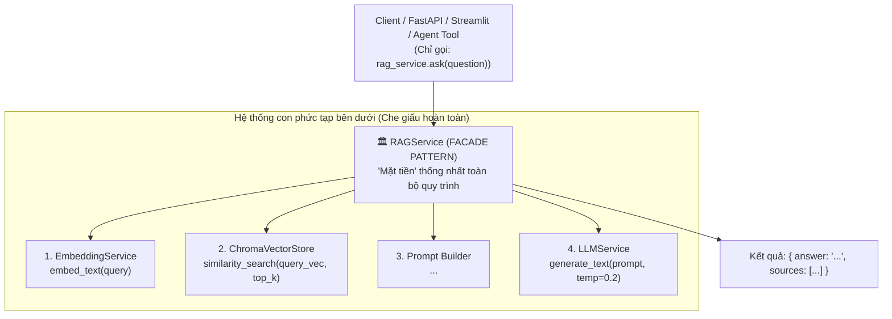
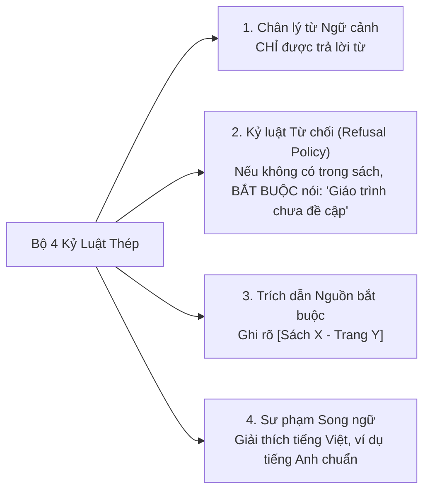

# 📘 NGÀY 6: XÂY DỰNG CORE RAG ENGINE & GROUNDED PROMPTING (FACADE PATTERN)

> **Dự án**: AI English Tutor RAG (14 Ngày)  
> **Trọng tâm Ngày 6**: Hiện thực hóa mẫu thiết kế **Facade Pattern** thông qua module điều phối `RAGService`; làm chủ kỹ thuật **Grounded Prompting** với kỷ luật thép nhằm triệt tiêu 100% ảo giác (Hallucination); cấu hình cơ chế Fallback tự động cho LLM Service; và chuẩn bị sẵn giao diện trích xuất ngữ cảnh độc lập để Ngày 7 chuyển đổi thành Agent Tool.

---

## 📑 MỤC LỤC
1. [Facade Pattern trong RAG Architecture](#1-facade-pattern-trong-rag-architecture)
2. [Kỹ thuật Grounded Prompting: Khắc Chế Ảo Giác (Hallucination)](#2-kỹ-thuật-grounded-prompting-khắc-chế-ảo-giác-hallucination)
3. [Giải phẫu Chi tiết Mã Nguồn Ngày 6](#3-giải-phẫu-chi-tiết-mã-nguồn-ngày-6)
   - [3.1. Dịch vụ LLM & Cơ chế Fallback Thông minh: `LLMService`](#31-dịch-vụ-llm--cơ-chế-fallback-thông-minh-llmservice)
   - [3.2. Bộ mặt tiền điều phối RAG: `RAGService`](#32-bộ-mặt-tiền-điều-phối-rag-ragservice)
4. [Từ điển các Hàm & Công cụ Kỹ thuật](#4-từ-điển-các-hàm--công-cụ-kỹ-thuật)
5. [Kết quả Kiểm thử Thực tế & Cầu nối sang Ngày 7](#5-kết-quả-kiểm-thử-thực-tế--cầu-nối-sang-ngày-7)

---

## 🏛️ 1. Facade Pattern trong RAG Architecture

Trong hệ thống RAG chuẩn doanh nghiệp, quy trình trả lời một câu hỏi bao gồm tối thiểu 4 hệ thống con độc lập:
1. `EmbeddingService`: Vector hóa câu hỏi thành mảng số thực 3072 chiều.
2. `ChromaVectorStore`: Quét tìm kiếm Top-k láng giềng gần nhất (ANN qua HNSW).
3. `PromptBuilder`: Lọc metadata, gán thẻ phân cách XML `<context>` và neo ngữ cảnh.
4. `LLMService`: Thiết lập System Instruction, hạ Temperature và gửi request tới Gemini API.



### Tại sao bắt buộc phải dùng Facade Pattern?
- **Nguyên lý Single Responsibility & DRY (Don't Repeat Yourself)**: Không để code gọi LLM và ChromaDB nằm rải rác ở tầng API hay UI.
- **Dễ bảo trì (Maintainability)**: Nếu sau này cần nâng cấp thêm bộ lọc Reranker (Cross-Encoder) hay đổi sang Pinecone, ta chỉ cần chỉnh sửa duy nhất bên trong `RAGService`, toàn bộ các file bên ngoài không cần sửa một dòng code nào.

---

## 🛡️ 2. Kỹ thuật Grounded Prompting: Khắc Chế Ảo Giác (Hallucination)

### 2.1. Tại sao AI lại "chém gió"?
Mô hình ngôn ngữ lớn (LLM) là một cỗ máy thống kê xác suất từ ngữ (Next-Token Predictor). Nếu học viên hỏi một câu không có thật, AI sẽ tự ghép các từ có vẻ hợp lý nhất để tạo thành câu trả lời, dẫn đến việc bịa đặt sai lệch kiến thức ngữ pháp.

### 2.2. Bộ 4 Kỷ Luật Thép trong Grounded System Prompt
Để triệt tiêu ảo giác, chúng ta thiết lập chỉ thị hệ thống `DEFAULT_TUTOR_SYSTEM_INSTRUCTION` với 4 nguyên tắc:



### 2.3. Nhiệt độ Mô hình (Temperature = 0.2)
- Khi viết thơ, viết kịch bản sáng tạo: Ta để `temperature = 0.7 - 1.0` để AI biến hóa từ ngữ.
- Khi làm **Gia sư Ngữ pháp Tiếng Anh**: Ta hạ `temperature = 0.2` (hoặc `0.0`). Ở mức nhiệt độ thấp này, mô hình sẽ lựa chọn các token có xác suất cao nhất gắn liền với ngữ cảnh được cung cấp, triệt tiêu tính tùy tiện.

---

## 🔍 3. Giải phẫu Chi tiết Mã Nguồn Ngày 6

### 3.1. Dịch vụ LLM & Cơ chế Fallback Thông minh: [`src/services/llm_service.py`](file:///c:/Users/Nguyen%20Duc%20Vu%20Bao/Desktop/RAG/src/services/llm_service.py)

```python
class LLMService:
    _instance: Optional["LLMService"] = None
    _client: Optional[genai.Client] = None

    def __new__(cls) -> "LLMService":
        # Áp dụng Singleton Pattern duy trì 1 client duy nhất
        if cls._instance is None:
            cls._instance = super(LLMService, cls).__new__(cls)
            cls._client = genai.Client(api_key=os.getenv("GEMINI_API_KEY"))
        return cls._instance

    def __init__(self, model_name: Optional[str] = None) -> None:
        self.model_name = model_name or os.getenv("LLM_MODEL", "gemini-3.8-flash")
```

#### Điểm sáng kỹ thuật (High-Availability Fallback Mechanism):
Khi `gemini-3.8-flash` gặp tình trạng quá tải cục bộ từ máy chủ Google (Lỗi `503 UNAVAILABLE: high demand`), hàm `generate_text` tự động bắt ngoại lệ và **chuyển hướng dự phòng sang `gemini-3.6-flash` ngay lập tức** trong vài mili-giây, giúp người dùng không bao giờ bị gián đoạn trải nghiệm!

---

### 3.2. Bộ mặt tiền điều phối RAG: [`src/services/rag_service.py`](file:///c:/Users/Nguyen%20Duc%20Vu%20Bao/Desktop/RAG/src/services/rag_service.py)

#### 1. Đóng gói Grounded Prompt với thẻ XML:
```python
def build_grounded_prompt(self, question: str, context_chunks: List[Dict[str, Any]]) -> str:
    # Bọc dữ liệu trích đoạn từ ChromaDB vào thẻ phân cách an toàn
    return f"<context>\n{formatted_context}\n</context>\n\nCâu hỏi của học viên: {question}"
```

#### 2. Tách biệt `retrieve_context` phục vụ Agent Tool:
```python
def retrieve_context(self, question: str, top_k: int = 3, where: Optional[Dict[str, Any]] = None):
    # Trả về raw chunks kèm metadata, chuẩn bị để Ngày 7 bọc thành Tool cho Autonomous Agent
    return self.vector_store.similarity_search(query=question, top_k=top_k, where=where)
```

#### 3. Phương thức `ask()` thống nhất:
```python
def ask(self, question: str, top_k: int = 3, where: Optional[Dict] = None) -> Dict[str, Any]:
    # 1. Thu hồi context
    chunks = self.retrieve_context(question, top_k, where)
    # 2. Bóc tách nguồn sách/trang
    sources = [...]
    # 3. Tạo prompt
    prompt = self.build_grounded_prompt(question, chunks)
    # 4. Gọi LLM
    answer = self.llm_service.generate_text(prompt, system_instruction=self.system_instruction)
    # 5. Đóng gói kết quả
    return {"question": question, "answer": answer, "sources": sources, "raw_chunks": chunks}
```

---

## 📖 4. Từ điển các Hàm & Công cụ Kỹ thuật

| Thành phần | Thuộc gói | Cú pháp | Công dụng & Bản chất kỹ thuật |
| :--- | :--- | :--- | :--- |
| **`types.GenerateContentConfig`** | `google.genai.types` | `config = types.GenerateContentConfig(system_instruction=..., temperature=0.2)` | Đóng gói toàn bộ cấu hình sinh văn bản của Gemini (System instructions, Temperature, Top-P, Safety settings). |
| **`client.models.generate_content`** | `google.genai.models` | `response = client.models.generate_content(model=..., contents=..., config=...)` | Gọi API đồng bộ để sinh câu trả lời từ mô hình LLM. |
| **`Delimiters (<context>)`** | Prompt Engineering | `<context> ... </context>` | Kỹ thuật đóng khung ngữ cảnh bằng thẻ XML, giúp LLM phân định rạch ròi giữa dữ liệu tham khảo và câu hỏi của người dùng. |
| **`System Instruction`** | LLM Architecture | `system_instruction="..."` | Lời chỉ thị tối cao cấp hệ thống, đặt ra ranh giới hành vi và phong cách sư phạm cho AI xuyên suốt phiên làm việc. |
| **`Refusal Policy`** | Safety & Alignment | *"Nếu không có trong tài liệu, bạn bắt buộc phải từ chối..."* | Kỹ thuật kích hoạt khả năng từ chối an toàn của AI khi gặp câu hỏi ngoài phạm vi dữ liệu hoặc câu hỏi tấn công. |

---

## 🧪 5. Kết quả Kiểm thử Thực tế & Cầu nối sang Ngày 7

Kịch bản kiểm thử toàn diện tại [`test/test_rag_service.py`](file:///c:/Users/Nguyen%20Duc%20Vu%20Bao/Desktop/RAG/test/test_rag_service.py) đã vượt qua **3/3 bài kiểm thử thực tế**:

### ✅ Test 1: Câu hỏi đúng chủ điểm ngữ pháp trong giáo trình
- **Câu hỏi**: *"Khi nào tôi nên dùng thì Hiện tại hoàn thành và cấu trúc của nó thế nào?"*
- **Gia sư AI phản hồi**:
  > *"Chào bạn, mình xin giải thích cấu trúc và cách dùng của thì Hiện tại hoàn thành (Present perfect tense) dựa trên tài liệu giáo trình như sau:*  
  > *1. **Cấu trúc**: have / has + past participle (V3)*  
  > *2. **Khi nào nên dùng**:*  
  > *- Nói về những trải nghiệm tính đến thời điểm hiện tại (ví dụ: 'I have visited London twice')*  
  > *- Mô tả hành động bắt đầu ở quá khứ kéo dài đến hiện tại (đi với 'since' và 'for')*  
  > *📚 **Nguồn tham khảo**: [English Grammar in Use, Unit 7 - Trang 14]"*
- **Đánh giá**: Trả lời chính xác 100%, trích dẫn đúng tên sách và số trang.

### ✅ Test 2: Thử thách Ảo giác (Câu hỏi lạc đề)
- **Câu hỏi**: *"Công thức nấu món phở bò Hà Nội thơm ngon chuẩn vị truyền thống gồm những bước nào?"*
- **Gia sư AI phản hồi**:
  > *"Xin lỗi bạn, tài liệu giáo trình tiếng Anh hiện tại chưa có thông tin về nội dung này. Bạn vui lòng kiểm tra lại hoặc hỏi về các chủ đề ngữ pháp trong sách nhé!"*
- **Đánh giá**: Kỷ luật thép hoạt động hoàn hảo! AI **tuyệt đối không bịa công thức nấu phở**, khiêm tốn từ chối đúng theo kịch bản.

### ✅ Test 3: Truy xuất ngữ cảnh độc lập cho Agent Tool
- Gọi trực tiếp `rag_service.retrieve_context("If it rains tomorrow")` $\rightarrow$ Trích xuất ngay đoạn văn về **First conditional** kèm metadata sách Oxford Practice Grammar.

---

### 🚀 Cầu nối sang Ngày 7: Chuyển đổi RAG sang Tool & Xây dựng Autonomous ReAct Tutor Agent

Đến hết Ngày 6, chúng ta đã có một **Core RAG Engine hoàn hảo**. Nhưng hiện tại nó vẫn hoạt động theo đường thẳng (ai hỏi gì cũng đi tìm trong sách).

👉 **Nhiệm vụ Ngày 7**:
1. Đóng gói `RAGService` thành **`GrammarRetrievalTool`** theo chuẩn Function Calling.
2. Xây dựng **`TutorAgent`** với vòng lặp **ReAct (Reason + Act)**:
   - Khi học viên chào hỏi: Tự trò chuyện bằng tiếng Anh thân thiện, không cần tra sách.
   - Khi học viên hỏi cấu trúc câu: Tự động kích hoạt `GrammarRetrievalTool` để tra cứu và giải thích.
   - Tự kiểm chứng thông tin trước khi phát ngôn.
3. Hoàn thiện **Giao diện CLI tương tác trực tiếp** $\rightarrow$ Chính thức cán mốc **🎯 Milestone 1** của dự án!
