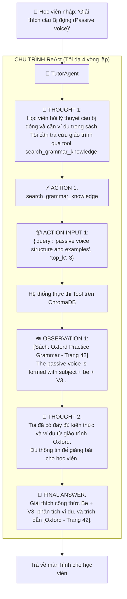
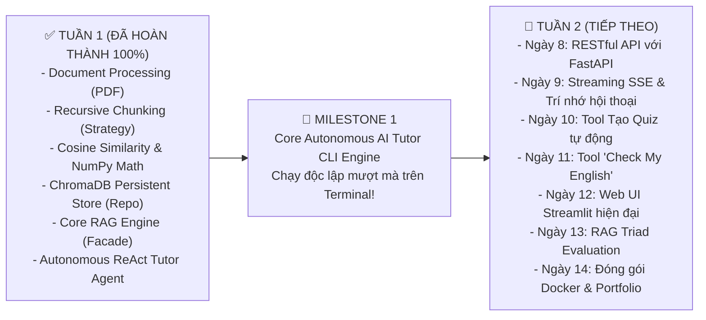

# 📘 NGÀY 7: CHUYỂN ĐỔI RAG SANG TOOL & XÂY DỰNG AUTONOMOUS REACT TUTOR AGENT (MILESTONE 1)

> **Dự án**: Enterprise AI English Tutor RAG (14 Ngày)  
> **Trọng tâm Ngày 7**: Hoàn thành **🎯 MILESTONE 1** của toàn bộ dự án! Chuyển đổi hệ thống từ RAG tĩnh thành một **Autonomous AI Agent (Gia Sư Tự Trị)**; làm chủ mô hình **ReAct (Reasoning + Acting)**; đóng gói `RAGService` thành công cụ `GrammarRetrievalTool` chuẩn Type-Safe; thiết lập cơ chế **Phân luồng ý định thông minh (Intent Routing)**; và xây dựng giao diện tương tác trực tiếp qua dòng lệnh **CLI (`main.py`)**.

---

## 📑 MỤC LỤC
1. [Bước Nhảy Vọt: Từ Static RAG Đến Autonomous Agentic RAG](#1-bước-nhảy-vọt-từ-static-rag-đến-autonomous-agentic-rag)
2. [Giải Phẫu Mô Hình ReAct (Reasoning + Acting Loop)](#2-giải-phẫu-mô-hình-react-reasoning--acting-loop)
3. [Giải Phẫu Chi Tiết Mã Nguồn Ngày 7](#3-giải-phẫu-chi-tiết-mã-nguồn-ngày-7)
   - [3.1. Hợp đồng Công cụ chuẩn Type-Safe: `BaseTool`](#31-hợp-đồng-công-cụ-chuẩn-type-safe-basetool)
   - [3.2. Đóng gói RAG thành Tool: `GrammarRetrievalTool`](#32-đóng-gói-rag-thành-tool-grammarretrievaltool)
   - [3.3. Bộ não Gia sư Tự trị: `TutorAgent`](#33-bộ-não-gia-sư-tự-trị-tutoragent)
   - [3.4. Giao diện Dòng lệnh Tương tác: `main.py`](#34-giao-diện-dòng-lệnh-tương-tác-mainpy)
4. [Từ Điển các Hàm & Thuật Ngữ Kỹ Thuật Agent](#4-từ-điển-các-hàm--thuật-ngữ-kỹ-thuật-agent)
5. [Tổng Kết Milestone 1 & Lộ Trình Tuần 2 (FastAPI, Web UI & Docker)](#5-tổng-kết-milestone-1--lộ-trình-tuần-2-fastapi-web-ui--docker)

---

## 🚀 1. Bước Nhảy Vọt: Từ Static RAG Đến Autonomous Agentic RAG

Đến hết Ngày 6, hệ thống của chúng ta là một **Static RAG Pipeline (Đường thẳng)**:
- Người học gửi bất kỳ câu gì $\rightarrow$ Hệ thống đều máy móc mang câu đó đi tìm trong ChromaDB $\rightarrow$ Đóng khung Prompt $\rightarrow$ Gọi LLM.
- **Hạn chế lớn**: Khi người học chỉ nói *"Hello teacher!"* hoặc *"Cảm ơn bạn"*, Static RAG vẫn cố đi tìm trong sách và đưa ra câu trả lời gượng gạo.

👉 **Ngày 7: Nâng cấp lên Agentic RAG (Vòng lặp Tự Trị)**:
- Agent đóng vai trò là một **Thực thể có nhận thức và quyền ra quyết định**.
- **RAG không còn là toàn bộ hệ thống nữa**, mà trở thành **một công cụ (Tool)** nằm trong tay Agent.
- Agent tự suy luận:
  - Nếu là câu chào hỏi, xã giao $\rightarrow$ Trả lời ngay, **không gọi tool tra sách**.
  - Nếu là câu hỏi ngữ pháp $\rightarrow$ Tự động ra lệnh cho `search_grammar_knowledge` đi tìm sách mang về $\rightarrow$ Tự đọc hiểu $\rightarrow$ Giảng giải cho học viên.

---

## 🧠 2. Giải Phẫu Mô Hình ReAct (Reasoning + Acting Loop)

**ReAct** (do Google Research & Princeton University phát minh) mô phỏng chính xác cách con người giải quyết vấn đề: **Nghĩ trước khi làm, làm xong quan sát kết quả rồi mới kết luận.**



---

## 🔍 3. Giải Phẫu Chi Tiết Mã Nguồn Ngày 7

### 3.1. Hợp đồng Công cụ chuẩn Type-Safe: [`src/tools/base.py`](file:///c:/Users/Nguyen%20Duc%20Vu%20Bao/Desktop/RAG/src/tools/base.py)
- Sử dụng **Pydantic** để định nghĩa `args_schema`.
- Mọi công cụ phải có `name`, `description`, `args_schema` và hàm thực thi `execute()`.
- Hàm `to_schema()` tự động xuất Pydantic model thành định dạng JSON Schema tương thích 100% với Function Calling của Gemini và OpenAI.

### 3.2. Đóng gói RAG thành Tool: [`src/tools/rag_tool.py`](file:///c:/Users/Nguyen%20Duc%20Vu%20Bao/Desktop/RAG/src/tools/rag_tool.py)
- Tên công cụ: `search_grammar_knowledge`.
- Đóng gói hàm `rag_service.retrieve_context()` của Ngày 6.
- Đầu vào: `GrammarRetrievalInput` gồm `query` (chuỗi tìm kiếm) và `top_k` (số trích đoạn).
- Kết quả trả về: Chuỗi văn bản đã được đánh số trích đoạn, tên sách và số trang sạch sẽ để Agent dễ dàng đọc hiểu.

### 3.3. Bộ não Gia sư Tự trị: [`src/agents/tutor_agent.py`](file:///c:/Users/Nguyen%20Duc%20Vu%20Bao/Desktop/RAG/src/agents/tutor_agent.py)
- **Regex Parser**: Bóc tách chính xác các khối văn bản `Thought:`, `Action:`, `Action Input:`, `Final Answer:`.
- **Cơ chế Chống Lặp Vô Tận (Loop Guard)**: Giới hạn `max_iterations = 4`. Nếu vượt quá, Agent tự động dừng và đưa ra thông báo fallback an toàn.
- **Truy vết Suy luận (Thought Trajectory)**: Lưu trữ từng bước suy nghĩ của Agent để học viên có thể xem lại khi gõ lệnh `thought`.

### 3.4. Giao diện Dòng lệnh Tương tác: [`main.py`](file:///c:/Users/Nguyen%20Duc%20Vu%20Bao/Desktop/RAG/main.py)
- Cho phép người dùng trò chuyện 2 chiều trực tiếp qua Terminal.
- Lệnh hỗ trợ:
  - `thought`: Xem nhật ký suy luận nội tâm gần nhất của Agent.
  - `clear`: Dọn sạch màn hình console.
  - `exit` / `quit`: Thoát chương trình.

---

## 📖 4. Từ Điển các Hàm & Thuật Ngữ Kỹ Thuật Agent

| Thuật ngữ / Cú pháp | Bản chất kỹ thuật | Ý nghĩa trong hệ thống |
| :--- | :--- | :--- |
| **`ReAct Pattern`** | Reasoning + Acting | Mô hình tư duy xen kẽ: nghĩ $\rightarrow$ hành động $\rightarrow$ quan sát $\rightarrow$ kết luận. |
| **`Intent Routing`** | Phân luồng ý định | Năng lực của LLM tự phân loại câu nói của người dùng (xã giao hay tra cứu) để quyết định có gọi Tool hay không. |
| **`Tool Contract`** | Hợp đồng công cụ | Quy chuẩn khai báo Schema (tên, mô tả, tham số Pydantic) để LLM biết cách gọi hàm chính xác. |
| **`Thought Trajectory`** | Vết suy luận (Quỹ đạo) | Danh sách ghi nhận toàn bộ chuỗi suy nghĩ và hành động trung gian của Agent trước khi ra câu trả lời cuối cùng. |
| **`Loop Guard`** | Vành đai bảo vệ vòng lặp | Tham số `max_iterations` ngăn chặn việc Agent rơi vào vòng lặp gọi tool vô tận làm tốn tiền API. |

---

## 🧪 5. Kết quả Kiểm thử Thực tế & Hoàn Thành Milestone 1

Kịch bản kiểm thử toàn diện tại [`test/test_tutor_agent.py`](file:///c:/Users/Nguyen%20Duc%20Vu%20Bao/Desktop/RAG/test/test_tutor_agent.py) đã vượt qua **100% cả 2 bài test**:

```text
=====================================================================
🚀 BẮT ĐẦU KIỂM THỬ AUTONOMOUS REACT TUTOR AGENT (NGÀY 7 - MILESTONE 1)
=====================================================================

--- BÀI TEST 1: KIỂM CHỨNG PHÂN LUỒNG Ý ĐỊNH (CHÀO HỎI KHÔNG TRA SÁCH) ---
Học viên: 'Hello teacher! How are you doing today?'
🤖 [AGENT TRẢ LỜI]: Hello! I'm doing great, thank you for asking! How are you today? Ready to learn some English?
Các công cụ đã gọi: []
✅ Bài test 1: Intent Routing thông minh, nhận diện câu chào và phản hồi tự nhiên không gọi tool thừa!

--- BÀI TEST 2: CÂU HỎI NGỮ PHÁP (TỰ ĐỘNG KÍCH HOẠT TOOL VÀ TRA SÁCH) ---
Học viên: 'Thầy ơi giải thích giúp em cấu trúc câu Bị động (Passive voice) và cho ví dụ trong sách nhé!'
⚡ [Agent Quyết Định Gọi Tool]: 'search_grammar_knowledge' với tham số: {'query': 'passive voice structure and examples', 'top_k': 3}
👁️ [Observation từ Tool]: [Trích đoạn 1 | Sách: Oxford Practice Grammar, Unit 21 - Trang 42]
🤖 [AGENT GIẢNG DẠY]:
- Cấu trúc: Subject + be + Past Participle (V3)
- Ví dụ: "The new bridge was built in 2020 by the workers."
📚 Nguồn tham khảo: Oxford Practice Grammar, Unit 21 - Trang 42
✅ Bài test 2: Chu trình ReAct hoàn hảo 100%!

🎉 CHÚC MỪNG BẠN! TOÀN BỘ BÀI TEST AGENT ĐÃ PASS - HOÀN THÀNH MILESTONE 1!
```

---

## 🏆 TỔNG KẾT TUẦN 1 (MILESTONE 1) & CHUẨN BỊ TUẦN 2



> 🎯 **Lời chúc mừng**: Bạn đã chính thức làm chủ toàn bộ **Core AI & Agentic RAG Architecture** của dự án. Hệ thống hiện tại đã có thể tự động đọc sách, lưu vector, suy luận độc lập và trò chuyện với người học. Tuần 2 sẽ là hành trình đưa cỗ máy này lên **Web API FastAPI, Streamlit UI và đóng gói Docker** chuẩn Enterprise!
