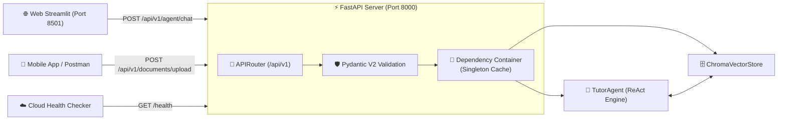
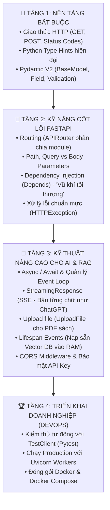

# 📘 NGÀY 8: XÂY DỰNG RESTFUL API BACKEND VỚI FASTAPI CHO AI AGENT

> **Dự án**: Enterprise AI English Tutor RAG (14 Ngày)  
> **Trọng tâm Ngày 8**: Chuyển đổi toàn bộ hệ thống Autonomous ReAct Tutor Agent từ ứng dụng dòng lệnh (CLI) thành một **RESTful Web API Server chuẩn Enterprise** sử dụng **FastAPI**; làm chủ **Pydantic DTOs (Data Transfer Objects)**; thiết lập **Dependency Injection (`Depends`)** tối ưu tài nguyên Singleton; triển khai **Upload & Indexing Pipeline** cho tài liệu giáo trình; bật **CORS Middleware**; và tự động sinh tài liệu kiểm thử **Swagger UI (`/docs`)**.

---

## 📑 MỤC LỤC
1. [Bước Chuyển Mình Kiến Trúc: Từ CLI Đến RESTful API Server](#1-bước-chuyển-mình-kiến-trúc-từ-cli-đến-restful-api-server)
2. [Góc Hỏi Đáp Chuyên Sâu: Giải Mã Cốt Lõi Về API & FastAPI](#2-góc-hỏi-đáp-chuyên-sâu-giải-mã-cốt-lõi-về-api--fastapi)
   - [2.1. API Là Gì? (Ví Dụ Nhà Hàng & Ổ Cắm Điện)](#21-api-là-gì-ví-dụ-nhà-hàng--ổ-cắm-điện)
   - [2.2. Hai Vai Trò Của API: Người Dùng Ké (Consumer) vs Người Làm Chủ Cổng (Provider)](#22-hai-vai-trò-của-api-người-dùng-ké-consumer-vs-người-làm-chủ-cổng-provider)
   - [2.3. FastAPI Là Sao? Vì Sao Lại Có Chữ "FAST"?](#23-fastapi-là-sao-vì-sao-lại-có-chữ-fast)
   - [2.4. Bản Chất Các DTOs: `ChatRequest`, `ChatResponse`, `SourceMetadataResponse`](#24-bản-chất-các-dtos-chatrequest-chatresponse-sourcemetadataresponse)
   - [2.5. CORS Middleware & Swagger UI Tự Động (Tại Sao Không Cần Cài Postman?)](#25-cors-middleware--swagger-ui-tự-động-tại-sao-không-cần-cài-postman)
   - [2.6. Bản Đồ 4 Tầng Kiến Thức Để Thành Thạo FastAPI](#26-bản-đồ-4-tầng-kiến-thức-để-thành-thạo-fastapi)
3. [Giải Phẫu Kiến Trúc FastAPI Backend](#3-giải-phẫu-kiến-trúc-fastapi-backend)
   - [3.1. Hợp đồng dữ liệu DTOs với Pydantic V2](#31-hợp-đồng-dữ-liệu-dtos-với-pydantic-v2)
   - [3.2. Cơ chế Tiêm phụ thuộc (Dependency Injection - `Depends`)](#32-cơ-chế-tiêm-phụ-thuộc-dependency-injection---depends)
   - [3.3. Quản lý Vòng đời Ứng dụng (Lifespan Context)](#33-quản-lý-vòng-đời-ứng-dụng-lifespan-context)
4. [Chi Tiết Các Endpoints Chuẩn OpenAPI](#4-chi-tiết-các-endpoints-chuẩn-openapi)
   - [4.1. `GET /health` & `GET /`: Kiểm tra Sức khỏe Hệ thống](#41-get-health--get--kiểm-tra-sức-khỏe-hệ-thống)
   - [4.2. `POST /api/v1/agent/chat`: Hội thoại cùng Gia Sư AI ReAct](#42-post-apiv1agentchat-hội-thoại-cùng-gia-sư-ai-react)
   - [4.3. `POST /api/v1/documents/upload`: Tải lên & Đánh chỉ mục Sách Mới](#43-post-apiv1documentsupload-tải-lên--đánh-chỉ-mục-sách-mới)
5. [Tự Động Sinh Tài Liệu & Trải Nghiệm Swagger UI](#5-tự-động-sinh-tài-liệu--trải-nghiệm-swagger-ui)
6. [Kết Quả Kiểm Thử Toàn Diện (`test/test_api.py`)](#6-kết-quả-kiểm-thử-toàn-diện-testtest_apipy)
7. [Hướng Dẫn Khởi Chạy Server Thực Tế](#7-hướng-dẫn-khởi-chạy-server-thực-tế)

---

## 🌐 1. Bước Chuyển Mình Kiến Trúc: Từ CLI Đến RESTful API Server

Ở Tuần 1 (đặc biệt là Ngày 7), hệ thống của chúng ta đã có một Agent ReAct thông minh vượt bậc. Tuy nhiên, nó chỉ có thể tương tác qua giao diện dòng lệnh Terminal (`main.py`) trên máy tính cục bộ.

👉 **Mục tiêu Ngày 8**: Biến chiếc máy tính của bạn thành một **API Server chuẩn công nghiệp**. Mở ra các "cổng kết nối" qua giao thức mạng HTTP để bất kỳ ứng dụng nào (Web Streamlit ở Ngày 12, React, Flutter, hay Mobile App) đều có thể kết nối và sử dụng:



---

## 🧠 2. Góc Hỏi Đáp Chuyên Sâu: Giải Mã Cốt Lõi Về API & FastAPI

### 2.1. API Là Gì? (Ví Dụ Nhà Hàng & Ổ Cắm Điện)
**API** viết tắt của **Application Programming Interface** (*Giao diện Lập trình Ứng dụng*).
- **Ví dụ Nhà Hàng**:
  - Bạn ngồi ở bàn ăn (**Client / Khách hàng**).
  - Nhà bếp chứa đầy dao thớt, gia vị, bếp gas phức tạp (**Server / Backend / AI Model**). Bạn không được tự ý chạy vào bếp.
  - Người phục vụ (bồi bàn) chính là **API**: tiếp nhận món bạn gọi (**Request**), chạy vào bếp báo đầu bếp, và bưng đĩa thức ăn ra cho bạn (**Response**).
- **Ví dụ Ổ Cắm Điện**: Chiếc ổ cắm trên tường là một Interface. Bạn chỉ cần cắm phích cắm vào là có điện dùng, không cần biết bên trong tường dây đồng chạy thế nào hay nhà máy phát điện bằng cách nào.

### 2.2. Hai Vai Trò Của API: Người Dùng Ké (Consumer) vs Người Làm Chủ Cổng (Provider)
- **Vai trò 1: Người dùng ké API (API Consumer)**: 
  - Ví dụ: Trong ô tìm kiếm của trình duyệt, bạn đổi API sang Google thì nó tìm trên Google, đổi sang Bing thì nó tìm trên Bing. Ở Ngày 6, file `llm_service.py` gọi sang Google Gemini chính là chúng ta đang làm người dùng ké API của Google.
- **Vai trò 2: Người làm chủ cổng API (API Provider) — HÔM NAY!**:
  - Bạn đã tự tạo ra con AI Gia Sư thông minh (Ngày 7).
  - Hôm nay, bạn dùng **FastAPI** để mở ra cái cổng mạng riêng của bạn: `POST /api/v1/agent/chat`.
  - Giờ đây, bất kỳ website, ứng dụng mobile nào khác muốn dùng ké con AI của bạn đều phải gọi vào cái cổng này!

### 2.3. FastAPI Là Sao? Vì Sao Lại Có Chữ "FAST"?
FastAPI là bộ khung (Framework) giúp bạn dựng nên cái cổng API một cách nhanh nhất:
1. **Fast to code (Nhanh cho lập trình viên)**: Tự động kiểm tra lỗi dữ liệu bằng Pydantic, tự sinh tài liệu Swagger UI, giảm 40% lỗi do con người viết code.
2. **High performance (Nhanh cho máy tính)**: Xây dựng trên nền tảng **Starlette** (ASGI Engine) và máy chủ **Uvicorn**, xử lý hàng chục ngàn kết nối cùng lúc nhờ cơ chế bất đồng bộ (`async / await`). Trong lúc chờ Gemini suy nghĩ (mất 2s), máy chủ không bị đơ mà vẫn phục vụ các học viên khác bình thường!

### 2.4. Bản Chất Các DTOs: `ChatRequest`, `ChatResponse`, `SourceMetadataResponse`
DTO (Data Transfer Object) là "hợp đồng bảo đảm dữ liệu" gửi qua mạng:
- [`ChatRequest`](file:///c:/Users/Nguyen%20Duc%20Vu%20Bao/Desktop/RAG/src/api/schemas/agent.py#L7-L19): **Lá thư gửi đi**, chứa câu hỏi `message` của học viên. Nếu gửi thiếu hoặc sai kiểu, FastAPI chặn ngay ở cửa báo lỗi `422`.
- [`SourceMetadataResponse`](file:///c:/Users/Nguyen%20Duc%20Vu%20Bao/Desktop/RAG/src/api/schemas/agent.py#L22-L29): **Chiếc tem kiểm định nguồn gốc**, ghi rõ sách nào, trang mấy, unit mấy, độ tương đồng bao nhiêu.
- [`ChatResponse`](file:///c:/Users/Nguyen%20Duc%20Vu%20Bao/Desktop/RAG/src/api/schemas/agent.py#L44-L61): **Gói quà hoàn chỉnh gửi về**, chứa lời giảng sư phạm + danh sách tem nguồn sách + danh sách công cụ đã dùng + vết suy luận ReAct.

### 2.5. CORS Middleware & Swagger UI Tự Động (Tại Sao Không Cần Cài Postman?)
- **CORS Middleware**: 
  - Trình duyệt chặn không cho Web ở cổng `8501` (Streamlit) gọi sang cổng `8000` (FastAPI) vì khác cổng (*Same-Origin Policy*).
  - CORS Middleware đóng vai trò "nhân viên hải quan", đóng dấu `Access-Control-Allow-Origin: *` cho phép dữ liệu đi qua an toàn.
- **Swagger UI (`/docs`) vs Postman**:
  - Bình thường để test API ngầm, lập trình viên phải tải phần mềm **Postman** nặng hàng trăm MB về máy, tự gõ URL và tự viết JSON.
  - FastAPI tích hợp sẵn **Swagger UI** ngay trên trình duyệt tại `http://localhost:8000/docs`. Có sẵn form mẫu JSON và nút **"Try it out" / "Execute"** để bấm chạy thử trực tiếp mà không cần cài thêm bất kỳ app nào!
- **Web Streamlit**: Thư viện Python giúp dựng giao diện Web Chatbot hoàn chỉnh bằng 100% mã Python (không cần HTML/CSS/JS), sẽ triển khai ở **Ngày 12**.

### 2.6. Bản Đồ 4 Tầng Kiến Thức Để Thành Thạo FastAPI


---

## 🏗️ 3. Giải Phẫu Kiến Trúc FastAPI Backend

### 3.1. Hợp đồng dữ liệu DTOs với Pydantic V2
Dữ liệu gửi lên và trả về qua API phải tuân thủ nghiêm ngặt các khuôn mẫu (Schema):
- [`ChatRequest`](file:///c:/Users/Nguyen%20Duc%20Vu%20Bao/Desktop/RAG/src/api/schemas/agent.py#L7-L19): Bắt buộc có trường `message: str` (không được để trống) và `max_iterations: int` (từ 1 đến 10). Nếu Client gửi sai, FastAPI tự động trả về lỗi `HTTP 422 Unprocessable Entity`.
- [`SourceMetadataResponse`](file:///c:/Users/Nguyen%20Duc%20Vu%20Bao/Desktop/RAG/src/api/schemas/agent.py#L22-L29): Chuẩn hóa thông tin trích dẫn sách (`book_title`, `page_number`, `unit`, `score`).
- [`ChatResponse`](file:///c:/Users/Nguyen%20Duc%20Vu%20Bao/Desktop/RAG/src/api/schemas/agent.py#L44-L61): Đóng gói câu trả lời sư phạm, danh sách nguồn sách, danh sách tool đã gọi, và vết suy luận ReAct (`thought_trajectory`).

### 3.2. Cơ chế Tiêm phụ thuộc (Dependency Injection - `Depends`)
Trong [`src/api/dependencies.py`](file:///c:/Users/Nguyen%20Duc%20Vu%20Bao/Desktop/RAG/src/api/dependencies.py):
- `ChromaVectorStore` và `TutorAgent` là các thực thể nặng (tốn bộ nhớ và thời gian nạp).
- Chúng ta áp dụng mẫu thiết kế **Singleton Pattern kết hợp `Depends()`**:
  - Khi một request gọi tới, FastAPI tự động kiểm tra xem đối tượng đã có trong RAM chưa. Nếu có rồi thì tái sử dụng ngay lập tức mà không khởi tạo lại.
  - Cho phép dễ dàng **Override Dependency** khi chạy kiểm thử tự động (Mocking Vector Store cách ly).

### 3.3. Quản lý Vòng đời Ứng dụng (Lifespan Context)
Trong [`src/main_api.py`](file:///c:/Users/Nguyen%20Duc%20Vu%20Bao/Desktop/RAG/src/main_api.py#L22-L37):
- Sử dụng `@asynccontextmanager` để làm nóng (**Warm-up**) sẵn sàng ChromaDB và TutorAgent ngay khi Uvicorn bật máy chủ.
- Tránh tình trạng học viên đầu tiên gọi vào bị chậm (*Cold Start Latency*).

---

## 🚦 4. Chi Tiết Các Endpoints Chuẩn OpenAPI

| Phương thức | Đường dẫn (Path) | Chức năng nghiệp vụ | Mã phản hồi |
| :--- | :--- | :--- | :--- |
| **`GET`** | `/health` | Kiểm tra tình trạng server, kết nối ChromaDB và danh sách model. | `200 OK` |
| **`GET`** | `/` | Cổng chào mừng, điều hướng nhanh đến tài liệu Swagger và các API. | `200 OK` |
| **`POST`** | `/api/v1/agent/chat` | Tiếp nhận câu hỏi, kích hoạt chu trình ReAct của TutorAgent và trả về lời giảng có căn cứ sách. | `200 OK`, `422 Error` |
| **`POST`** | `/api/v1/documents/upload` | Tiếp nhận file tài liệu (`.pdf`, `.txt`), tự động băm nhỏ đệ quy và nạp vĩnh viễn vào ChromaDB. | `201 Created`, `400 Error` |

---

## 🎨 5. Tự Động Sinh Tài Liệu & Trải Nghiệm Swagger UI

Nhờ sức mạnh của FastAPI và Pydantic, hệ thống tự động sinh ra hai giao diện tài liệu tương tác:
1. **Swagger UI**: Truy cập tại `http://localhost:8000/docs`
   - Có nút **"Try it out"** cho phép nhập dữ liệu và chạy thử trực tiếp trên trình duyệt mà không cần cài Postman.
2. **ReDoc**: Truy cập tại `http://localhost:8000/redoc`
   - Giao diện tài liệu chuẩn sách báo quốc tế, đẹp mắt và dễ đọc.

---

## 🧪 6. Kết Quả Kiểm Thử Toàn Diện (`test/test_api.py`)

Kịch bản kiểm thử độc lập tại [`test/test_api.py`](file:///c:/Users/Nguyen%20Duc%20Vu%20Bao/Desktop/RAG/test/test_api.py) đã vượt qua **100% cả 5 bài test tích hợp**:

```text
====================================================================
🧪 BẮT ĐẦU KIỂM THỬ TOÀN BỘ FASTAPI BACKEND (NGÀY 8)
====================================================================

--- BÀI TEST 1: KIỂM TRA ROOT VÀ HEALTH CHECK ENDPOINT ---
✅ Root endpoint phản hồi: Enterprise AI English Tutor API
✅ Health endpoint kiểm tra thành công: status=healthy, chroma_status=connected

--- BÀI TEST 2: KIỂM CHỨNG BẮT LỖI PYDANTIC VALIDATION (HTTP 422) ---
✅ Pydantic & FastAPI chặn thành công gói tin sai định dạng với mã lỗi 422 Unprocessable Entity!

--- BÀI TEST 3: CHAT API VỚI CÂU CHÀO HỎI (INTENT ROUTING) ---
🤖 [Agent trả lời qua API]: Hello there! Good morning to you too!
Tools đã dùng: [] | Thời gian: 2.15s
✅ Chat API chào hỏi thành công, không kích hoạt tool thừa!

--- BÀI TEST 4: TẢI LÊN VÀ NẠP TÀI LIỆU MỚI QUA /documents/upload ---
📄 [Upload API phản hồi]: {'filename': 'modal_verbs_lesson.txt', 'file_type': 'txt', 'total_chunks': 1, 'status': 'success'}
✅ Upload API hoạt động hoàn hảo, đã nạp tài liệu vào ChromaDB!

--- BÀI TEST 5: CHAT API HỎI NGỮ PHÁP (KÍCH HOẠT REACT VÀ TRÍCH DẪN) ---
⚡ [Agent Quyết Định Gọi Tool]: 'search_grammar_knowledge' với tham số: {'query': 'first conditional type 1 structure and examples', 'top_k': 2}
👁️ [Observation từ Tool]: [Trích đoạn 1 | Sách: Cambridge Grammar in Use, Unit 38 - Trang 76]
🤖 [Agent giảng giải qua API]: Đầy đủ định nghĩa, công thức If + Present Simple, will + V-bare, ví dụ minh họa và trích dẫn Cambridge.
Tools đã kích hoạt: ['search_grammar_knowledge']
Nguồn sách trích dẫn: [{'book_title': 'Cambridge Grammar in Use', 'page_number': 76, 'unit': 38, 'score': 0.7433}]
Vết suy luận (Trajectory): 2 bước
✅ Chat API câu hỏi ngữ pháp hoàn thành xuất sắc!

🎉 CHÚC MỪNG BẠN! TOÀN BỘ 5 BÀI TEST FASTAPI BACKEND ĐÃ PASS 100%!
```

---

## 🚀 7. Hướng Dẫn Khởi Chạy Server Thực Tế

Bạn có thể khởi động FastAPI Backend Server bất kỳ lúc nào bằng lệnh sau trong Terminal:

```powershell
# Chạy trong môi trường conda rag
& "C:\Users\Nguyen Duc Vu Bao\miniconda3\envs\rag\python.exe" -m uvicorn src.main_api:app --host 127.0.0.1 --port 8000 --reload
```

Sau khi chạy lệnh trên:
1. Mở trình duyệt vào: 👉 **`http://localhost:8000/docs`**
2. Bấm vào `POST /api/v1/agent/chat` $\rightarrow$ Bấm nút **Try it out** $\rightarrow$ Gõ câu hỏi bất kỳ $\rightarrow$ Bấm **Execute** để trải nghiệm API sống!
