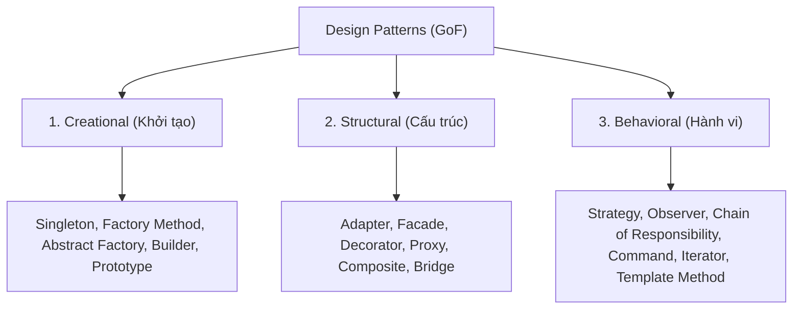

# 📐 KIẾN THỨC TOÀN DIỆN VỀ DESIGN PATTERNS TRONG DỰ ÁN AI & BACKEND

> **Mục tiêu tài liệu**: Cung cấp nền tảng lý thuyết vững chắc về các **Mẫu thiết kế phần mềm (Design Patterns)**, phân loại 3 nhóm kinh điển của GoF (Gang of Four), và hướng dẫn chi tiết cách áp dụng thực tế trong hệ thống **AI / RAG & Backend FastAPI Enterprise**.

---

## 📑 MỤC LỤC
1. [Design Pattern là gì & Tại sao cần sử dụng?](#1-design-pattern-là-gì--tại-sao-cần-sử-dụng)
2. [Phân loại 3 Nhóm Design Patterns Kinh Điển (GoF)](#2-phân-loại-3-nhóm-design-patterns-kinh-điển-gof)
3. [Các Design Patterns Cốt Lõi Ứng Dụng Trong Dự Án RAG](#3-các-design-patterns-cốt-lõi-ứng-dụng-trong-dự-án-rag)
   - [3.1. Singleton Pattern (Quản lý Connection / Client)](#31-singleton-pattern-quản-lý-connection--client)
   - [3.2. Factory Method Pattern (Khởi tạo Model linh hoạt)](#32-factory-method-pattern-khởi-tạo-model-linh-hoạt)
   - [3.3. Strategy Pattern (Chiến lược Chunking / Retrieval)](#33-strategy-pattern-chiến-lược-chunking--retrieval)
   - [3.4. Facade Pattern (Đơn giản hóa luồng RAG Pipeline)](#34-facade-pattern-đơn-giản-hóa-luồng-rag-pipeline)
   - [3.5. Repository Pattern (Trừu tượng hóa Vector Database)](#35-repository-pattern-trừu-tượng-hóa-vector-database)
   - [3.6. Dependency Injection (DI trong FastAPI)](#36-dependency-injection-di-trong-fastapi)
4. [Bảng Tra Cứu Tóm Tắt & Ứng Dụng](#4-bảng-tra-cứu-tóm-tắt--ứng-dụng)

---

## 💡 1. Design Pattern là gì & Tại sao cần sử dụng?

### 1.1. Khái niệm
**Design Pattern (Mẫu thiết kế)** là một giải pháp mẫu tổng quát, có thể tái sử dụng cho các vấn đề thường gặp trong quá trình thiết kế kiến trúc phần mềm. 

Nó không phải là một thư viện hay một đoạn mã cụ thể để copy-paste, mà là một **khung tư duy kiến trúc (Architectural Blueprint)**.

### 1.2. Lợi ích trong dự án thực tế
1. **Tăng tính bảo trì (Maintainability)**: Code không bị rối (Spaghetti Code), dễ đọc và sửa lỗi.
2. **Khả năng mở rộng (Scalability & Extensibility)**: Thêm tính năng mới (ví dụ: thêm loại AI Model mới, thêm Vector DB mới) mà không làm vỡ logic cũ (Tuân thủ nguyên lý *Open/Closed Principle*).
3. **Tiêu chuẩn giao tiếp trong nhóm**: Thay vì giải thích 10 phút, bạn chỉ cần nói *"Chỗ này dùng Factory Pattern"* là các kỹ sư khác hiểu ngay cấu trúc.

---

## 🧭 2. Phân loại 3 Nhóm Design Patterns Kinh Điển (GoF)



1. **Creational Patterns (Nhóm Khởi tạo)**:
   - Tập trung vào cách **khởi tạo Object**. Giúp che giấu logic tạo đối tượng phức tạp và kiểm soát số lượng instance trong bộ nhớ.
2. **Structural Patterns (Nhóm Cấu trúc)**:
   - Tập trung vào cách **lắp ráp, kết nối các Class và Object** lại với nhau thành các cấu trúc lớn hơn mà vẫn giữ được sự linh hoạt và độc lập.
3. **Behavioral Patterns (Nhóm Hành vi)**:
   - Tập trung vào **hành vi, thuật toán và sự phân chia trách nhiệm/giao tiếp** giữa các Object.

---

## 🎯 3. Các Design Patterns Cốt Lõi Ứng Dụng Trong Dự Án RAG

---

### 3.1. Singleton Pattern (Quản lý Connection / Client)
* **Nhóm**: Creational
* **Mục đích**: Đảm bảo một Class chỉ có duy nhất một Instance (đối tượng) trong suốt vòng đời của chương trình và cung cấp một điểm truy cập toàn cục tới nó.
* **Tại sao cần trong RAG?**: Việc kết nối tới Google Gemini API Client hoặc cơ sở dữ liệu ChromaDB tốn tài nguyên và thời gian handshake. Chúng ta chỉ muốn khởi tạo 1 lần duy nhất cho toàn bộ server.

```python
from google import genai
import os

class GeminiClientSingleton:
    _instance = None
    _client = None

    def __new__(cls):
        if cls._instance is None:
            cls._instance = super(GeminiClientSingleton, cls).__new__(cls)
            api_key = os.getenv("GEMINI_API_KEY")
            cls._client = genai.Client(api_key=api_key)
        return cls._instance

    @property
    def client(self) -> genai.Client:
        return self._client

# Sử dụng ở mọi nơi trong dự án:
# Dù gọi 100 lần thì vẫn chỉ có 1 kết nối duy nhất được tạo ra!
client = GeminiClientSingleton().client
```

---

### 3.2. Factory Method Pattern (Khởi tạo Model linh hoạt)
* **Nhóm**: Creational
* **Mục đích**: Định nghĩa một interface tạo đối tượng, nhưng để lớp con hoặc hàm Factory quyết định class cụ thể nào sẽ được khởi tạo.
* **Tại sao cần trong RAG?**: Hôm nay dự án dùng `GeminiEmbeddings`, ngày mai muốn chuyển sang `OpenAIEmbeddings` hoặc mô hình cục bộ `HuggingFaceBGE`. Ta không muốn sửa code ở khắp nơi.

```python
from abc import ABC, abstractmethod
from typing import List

class BaseEmbeddingService(ABC):
    @abstractmethod
    def embed_text(self, text: str) -> List[float]:
        pass

class GeminiEmbeddingService(BaseEmbeddingService):
    def embed_text(self, text: str) -> List[float]:
        # Logic gọi Google Gemini Embedding
        return [0.1, 0.2, 0.3]

class OpenAIEmbeddingService(BaseEmbeddingService):
    def embed_text(self, text: str) -> List[float]:
        # Logic gọi OpenAI text-embedding-3-small
        return [0.4, 0.5, 0.6]

# Factory Class
class EmbeddingServiceFactory:
    @staticmethod
    def create(provider: str) -> BaseEmbeddingService:
        if provider == "gemini":
            return GeminiEmbeddingService()
        elif provider == "openai":
            return OpenAIEmbeddingService()
        else:
            raise ValueError(f"Không hỗ trợ provider: {provider}")

# Sử dụng: Thay đổi dễ dàng qua file cấu hình .env
embedding_service = EmbeddingServiceFactory.create("gemini")
```

---

### 3.3. Strategy Pattern (Chiến lược Chunking / Retrieval)
* **Nhóm**: Behavioral
* **Mục đích**: Định nghĩa một họ các thuật toán, đóng gói từng thuật toán lại và làm cho chúng có thể hoán đổi linh hoạt cho nhau khi chương trình đang chạy.
* **Tại sao cần trong RAG?**: 
  - Với sách ngữ pháp: Cắt theo cấu trúc bài học (`GrammarUnitStrategy`).
  - Với bài đọc dài (IELTS Reading): Cắt theo đoạn văn ngữ nghĩa (`RecursiveParagraphStrategy`).

```python
from abc import ABC, abstractmethod
from typing import List

# 1. Interface chiến lược
class ChunkingStrategy(ABC):
    @abstractmethod
    def split(self, text: str) -> List[str]:
        pass

# 2. Chiến lược 1: Cắt theo đoạn văn
class ParagraphChunking(ChunkingStrategy):
    def split(self, text: str) -> List[str]:
        return [p.strip() for p in text.split("\n\n") if p.strip()]

# 3. Chiến lược 2: Cắt kích thước cố định có gối đầu (Overlap)
class FixedSizeOverlapChunking(ChunkingStrategy):
    def __init__(self, size: int = 500, overlap: int = 50):
        self.size = size
        self.overlap = overlap

    def split(self, text: str) -> List[str]:
        chunks = []
        start = 0
        while start < len(text):
            chunks.append(text[start:start + self.size])
            start += self.size - self.overlap
        return chunks

# 4. Context sử dụng: Có thể gán chiến lược tùy chọn
class DocumentProcessor:
    def __init__(self, strategy: ChunkingStrategy):
        self._strategy = strategy

    def set_strategy(self, strategy: ChunkingStrategy):
        self._strategy = strategy

    def process(self, document_text: str) -> List[str]:
        return self._strategy.split(document_text)
```

---

### 3.4. Facade Pattern (Đơn giản hóa luồng RAG Pipeline)
* **Nhóm**: Structural
* **Mục đích**: Cung cấp một giao diện đơn giản, cấp cao che giấu toàn bộ sự phức tạp của một hệ thống con (Subsystem) gồm nhiều thành phần phối hợp.
* **Tại sao cần trong RAG?**: Luồng RAG có 5-6 bước phức tạp: *Tạo embedding cho câu hỏi $\rightarrow$ Tìm Top-k trong ChromaDB $\rightarrow$ Ráp context $\rightarrow$ Thiết lập System Prompt $\rightarrow$ Gọi LLM $\rightarrow$ Format nguồn trích dẫn*. Facade đóng gói tất cả thành một hàm duy nhất `ask(query)`.

```python
class EnglishTutorRAGFacade:
    def __init__(self, embed_service, vector_store, llm_service):
        self.embed_service = embed_service
        self.vector_store = vector_store
        self.llm_service = llm_service

    def ask(self, user_question: str) -> dict:
        """Che giấu toàn bộ quy trình RAG phức tạp bên trong."""
        # 1. Tạo vector
        query_vector = self.embed_service.embed_text(user_question)
        
        # 2. Tìm tài liệu liên quan
        relevant_docs = self.vector_store.search(query_vector, top_k=3)
        
        # 3. Ghép context
        context_str = "\n\n".join([doc["content"] for doc in relevant_docs])
        
        # 4. Gọi LLM Gia sư
        answer = self.llm_service.generate_tutor_response(user_question, context_str)
        
        # 5. Đóng gói kết quả
        return {
            "answer": answer,
            "sources": [doc["metadata"] for doc in relevant_docs]
        }

# Bên ngoài (FastAPI Endpoint hay Streamlit UI) chỉ cần gọi 1 dòng:
# result = tutor_rag.ask("Phân biệt In/On/At khi chỉ thời gian")
```

---

### 3.5. Repository Pattern (Trừu tượng hóa Vector Database)
* **Nhóm**: Architectural Pattern
* **Mục đích**: Tạo một tầng trung gian giữa Business Logic và tầng lưu trữ dữ liệu (Data Access Layer), giúp quản lý các thao tác CRUD và tìm kiếm như một tập hợp đối tượng trong bộ nhớ.

```python
from abc import ABC, abstractmethod
from typing import List, Dict, Any

class BaseVectorRepository(ABC):
    @abstractmethod
    def add_documents(self, chunks: List[str], metadatas: List[Dict[str, Any]], ids: List[str]) -> None:
        pass

    @abstractmethod
    def search_similar(self, query_vector: List[float], top_k: int = 3) -> List[Dict[str, Any]]:
        pass

class ChromaVectorRepository(BaseVectorRepository):
    def __init__(self, collection_name: str, persist_dir: str):
        # Khởi tạo ChromaDB client & collection
        ...

    def add_documents(self, chunks, metadatas, ids):
        # Thao tác add vào ChromaDB
        ...

    def search_similar(self, query_vector, top_k = 3):
        # Thao tác query ChromaDB
        ...
```

---

### 3.6. Dependency Injection (DI trong FastAPI)
* **Nhóm**: Architectural / Structural Pattern
* **Mục đích**: Thay vì để một Class tự khởi tạo các đối tượng phụ thuộc bên trong nó, các đối tượng này sẽ được "tiêm" (inject) từ bên ngoài vào. Giúp viết **Unit Test cực kỳ dễ dàng** bằng cách mock service.

```python
from fastapi import FastAPI, Depends

app = FastAPI()

# Dependency Provider
def get_tutor_service() -> EnglishTutorRAGFacade:
    # Trả về instance của RAG Facade
    return app.state.tutor_service

# Endpoint được tiêm (inject) service vào
@app.post("/api/v1/chat")
def chat_with_tutor(
    query: str,
    tutor_service: EnglishTutorRAGFacade = Depends(get_tutor_service)
):
    result = tutor_service.ask(query)
    return result
```

---

## 📊 4. Bảng Tra Cứu Tóm Tắt & Ứng Dụng

| Design Pattern | Nhóm | Áp dụng vào thành phần nào trong dự án RAG? | Lợi ích đạt được |
| :--- | :--- | :--- | :--- |
| **Singleton** | Creational | Quản lý kết nối Client Gemini & ChromaDB. | Tiết kiệm RAM, tránh tạo nhiều kết nối thừa. |
| **Factory Method** | Creational | Module tạo Embedding Service / LLM Provider. | Đổi mô hình AI qua `.env` mà không sửa code. |
| **Strategy** | Behavioral | Module cắt nhỏ văn bản (`ChunkerService`). | Linh hoạt thuật toán cắt cho từng loại sách tiếng Anh. |
| **Facade** | Structural | Pipeline RAG (`RAGService`). | Đơn giản hóa toàn bộ luồng RAG cho FastAPI và Web UI. |
| **Repository** | Architectural | Tầng truy vấn Vector Database (`ChromaStore`). | Tách biệt logic nghiệp vụ khỏi câu lệnh DB thô. |
| **Dependency Injection** | Structural | Router & Endpoints của FastAPI (`Depends()`). | Code sạch, dễ test (Mocking) trong `pytest`. |

---

> 💡 **Lời khuyên thực hành**: Trong suốt 14 ngày của dự án, chúng ta sẽ lần lượt áp dụng từng pattern này vào mã nguồn thật để bạn hiểu sâu và làm chủ hoàn toàn!
