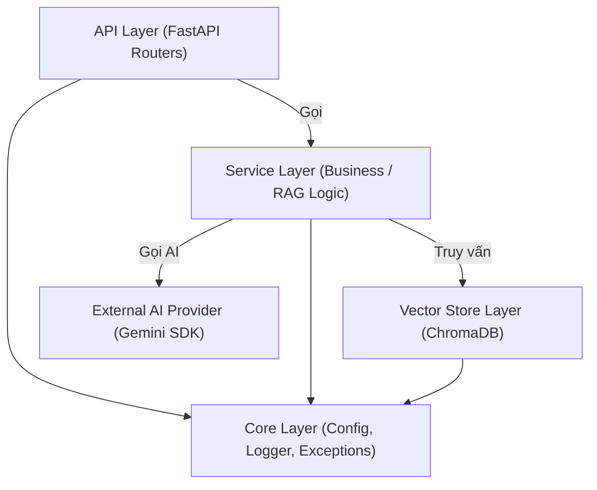

# 🏢 ENTERPRISE PROJECT GUIDELINES & BEST PRACTICES
## Quy chuẩn Kỹ thuật & Nguyên tắc Xây dựng Dự án AI/RAG Chuẩn Doanh Nghiệp

> **Tài liệu này là kim chỉ nam (Single Source of Truth)** quy định các tiêu chuẩn kiến trúc, quy tắc viết mã (Coding Standards), xử lý lỗi, logging và bảo mật áp dụng xuyên suốt 14 ngày của dự án **AI English Tutor RAG**.

---

## 📑 MỤC LỤC
1. [Nguyên tắc Thiết kế Kiến trúc (Architecture Principles)](#1-nguyên-tắc-thiết-kế-kiến-trúc-architecture-principles)
2. [Quy chuẩn Viết Code (Coding Standards)](#2-quy-chuẩn-viết-code-coding-standards)
3. [Quản lý Cấu hình & Biến môi trường](#3-quản-lý-cấu-hình--biến-môi-trường)
4. [Quy chuẩn Logging & Error Handling](#4-quy-chuẩn-logging--error-handling)
5. [Quy chuẩn Thiết kế API (FastAPI)](#5-quy-chuẩn-thiết-kế-api-fastapi)
6. [Quy chuẩn Kiểm thử (Testing)](#6-quy-chuẩn-kiểm-thử-testing)
7. [Checklist Trước khi Commit / Đẩy Code](#7-checklist-trước-khi-commit--đẩy-code)

---

## 🏛️ 1. Nguyên tắc Thiết kế Kiến trúc (Architecture Principles)

### 1.1. Phân tầng Trách nhiệm (Layered / Clean Architecture)
Hệ thống được chia thành 4 tầng độc lập:
1. **API Layer (`src/api/`)**: Chỉ làm nhiệm vụ tiếp nhận HTTP request, validate dữ liệu đầu vào qua Pydantic, gọi Service và trả về response. **Tuyệt đối không chứa logic AI/RAG hay xử lý PDF ở tầng này**.
2. **Service / Business Layer (`src/services/`)**: Chứa toàn bộ nghiệp vụ cốt lõi: xử lý văn bản, tạo embedding, truy vấn vector, gọi LLM, tính toán prompt.
3. **Data / Vector Store Layer (`src/vector_store/`)**: Đóng gói các thao tác với cơ sở dữ liệu và vector DB (ChromaDB, SQLite).
4. **Core Layer (`src/core/`)**: Chứa các tiện ích dùng chung: Cấu hình hệ thống, Logger tập trung, Định nghĩa Custom Exceptions.



### 1.2. Nguyên lý Dependency Inversion & Interface Abstraction
- Mọi kết nối ra ngoài (LLM, Vector DB) đều nên kế thừa từ một lớp trừu tượng (Base Interface).
- Ví dụ: `BaseVectorStore` có các phương thức `add_documents()` và `similarity_search()`. Điều này giúp hệ thống dễ dàng thay thế ChromaDB bằng Qdrant hoặc Pinecone trong tương lai mà không làm vỡ code ở tầng Service.

---

## 🖋️ 2. Quy chuẩn Viết Code (Coding Standards)

### 2.1. Bắt buộc sử dụng Type Hints 100%
Mọi hàm, biến và tham số phải có kiểu dữ liệu rõ ràng:
```python
# ❌ Không chuẩn (Code nghiệp dư):
def get_chunks(text, size):
    return chunks

# ✅ Chuẩn Doanh nghiệp:
from typing import List, Dict, Any

def get_chunks(text: str, chunk_size: int = 500) -> List[Dict[str, Any]]:
    """Tách văn bản thành danh sách các chunk kèm metadata."""
    ...
```

### 2.2. Viết Docstrings & Comment chuẩn Google Style
- Mọi class và hàm nghiệp vụ phải có Docstring mô tả: **Mục đích**, **Args (Tham số)**, **Returns (Kết quả)** và **Raises (Các lỗi có thể ném ra)**.

### 2.3. Quy tắc đặt tên (Naming Conventions)
- **Tên biến & hàm**: `snake_case` (ví dụ: `process_pdf_document()`, `embedding_vector`).
- **Tên Class**: `PascalCase` (ví dụ: `DocumentService`, `ChromaVectorStore`).
- **Hằng số**: `UPPER_SNAKE_CASE` (ví dụ: `DEFAULT_CHUNK_SIZE = 500`).

---

## 🔐 3. Quản lý Cấu hình & Biến môi trường

### 3.1. Tuyệt đối không Hardcode Secret
- Không ghi API Key, mật khẩu, đường dẫn tuyệt đối máy cá nhân vào mã nguồn.
- Tất cả cấu hình được quản lý tập trung bằng **Pydantic Settings** (`config/settings.py`):

```python
from pydantic_settings import BaseSettings

class Settings(BaseSettings):
    PROJECT_NAME: str = "AI English Tutor RAG"
    GEMINI_API_KEY: str
    LLM_MODEL: str = "gemini-3.6-flash"
    EMBEDDING_MODEL: str = "gemini-embedding-001"
    CHROMA_PERSIST_DIR: str = "./data/chroma_db"
    
    class Config:
        env_file = ".env"

settings = Settings()
```

### 3.2. Cung cấp file `.env.example`
- Luôn giữ 1 file `.env.example` với các tên biến mẫu (không chứa key thật) để người khác hoặc server CI/CD biết cần cấu hình những biến nào.

---

## 📋 4. Quy chuẩn Logging & Error Handling

### 4.1. Cấm dùng `print()` trong mã nguồn Production
- Thay `print()` bằng **Logger** (`logging` hoặc `loguru`):
```python
import logging

logger = logging.getLogger(__name__)

# Ghi nhận thông tin bình thường:
logger.info("Đã trích xuất thành công 15 trang từ file grammar.pdf")

# Cảnh báo:
logger.warning("Chunk thứ 3 có độ dài ngắn hơn bình thường (dưới 50 ký tự)")

# Báo lỗi:
logger.error("Không thể kết nối tới ChromaDB", exc_info=True)
```

### 4.2. Custom Exceptions rõ ràng
Định nghĩa cây lỗi nghiệp vụ trong `src/core/exceptions.py`:
- `AppException` (Lớp lỗi cơ sở)
  - `DocumentLoadError` (Lỗi đọc file PDF hỏng, sai định dạng)
  - `LLMServiceError` (Lỗi rate limit, hết quota, mất mạng)
  - `VectorStoreError` (Lỗi truy vấn database vector)

---

## 🌐 5. Quy chuẩn Thiết kế API (FastAPI)

1. **Chuẩn hóa URL**: Dùng danh từ số nhiều và tiền tố phiên bản:
   - `POST /api/v1/tutor/chat`
   - `POST /api/v1/documents/ingest`
   - `GET /api/v1/health`
2. **Chuẩn hóa Request/Response với Pydantic Schemas**:
   ```python
   from pydantic import BaseModel, Field

   class ChatRequest(BaseModel):
       query: str = Field(..., min_length=2, max_length=1000, description="Câu hỏi của người học")
       book_filter: str | None = Field(None, description="Tùy chọn lọc theo tên sách")

   class ChatResponse(BaseModel):
       answer: str
       sources: list[dict]
   ```
3. **Response Status Codes chuẩn HTTP**:
   - `200 OK`: Thành công.
   - `400 Bad Request`: Sai dữ liệu đầu vào.
   - `404 Not Found`: Không tìm thấy tài liệu.
   - `500 Internal Server Error`: Lỗi máy chủ (được bắt và format JSON gọn gàng).

---

## 🧪 6. Quy chuẩn Kiểm thử (Testing)

- Thư mục `tests/` chứa các test case tự động chạy bằng `pytest`.
- Mỗi module nghiệp vụ mới viết ra phải có ít nhất:
  - 1 Unit Test cho trường hợp chạy bình thường (Happy Path).
  - 1 Unit Test cho trường hợp lỗi (Edge Case / Error Handling).

---

## ✅ 7. Checklist Trước khi Commit Code

Trước khi đánh dấu hoàn thành nhiệm vụ mỗi ngày:
- [ ] Code không còn dòng `print()` thừa thãi để debug (đã thay bằng logger hoặc xóa đi).
- [ ] Không có API Key hoặc thông tin nhạy cảm trong code.
- [ ] Tất cả hàm đều có **Type Hints** và **Docstrings**.
- [ ] File `.env` không nằm trong git tracking (kiểm tra `git status`).
- [ ] Đã cập nhật ghi chú kiến thức vào `docs/DAY_XX.md`.
