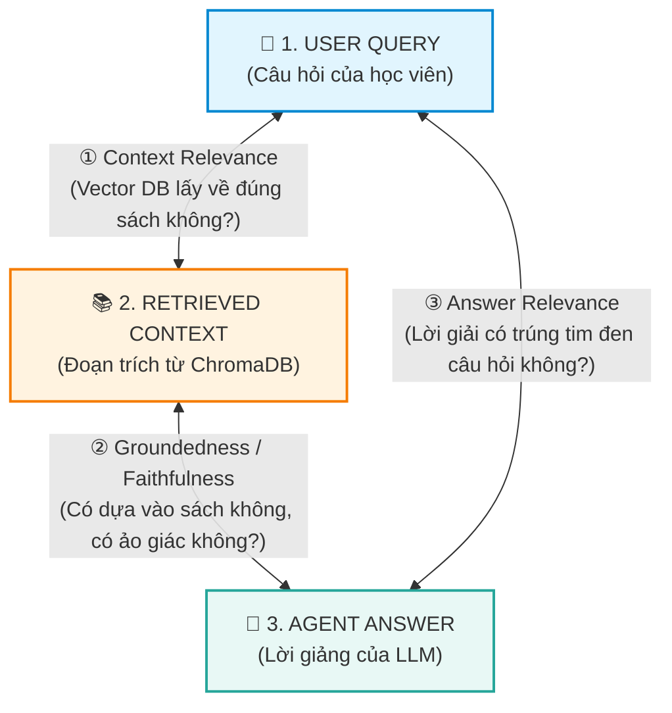
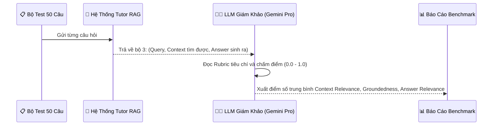

# 📊 HƯỚNG DẪN TOÀN DIỆN: ĐÁNH GIÁ MÔ HÌNH RAG & AGENT (RAG EVALUATION GUIDE)

> **Tài liệu chuyên đề**: Cẩm nang thẩm định chất lượng hệ thống RAG & Autonomous Agent chuẩn Enterprise.  
> **Áp dụng chính thức tại**: **Ngày 13 (Tuần 2)** trong lộ trình dự án [ROADMAP.md](file:///c:/Users/Nguyen%20Duc%20Vu%20Bao/Desktop/RAG/ROADMAP.md#L131-L135).

---

## 📑 MỤC LỤC
1. [Tại Sao Phải Đánh Giá RAG Tự Động?](#1-tại-sao-phải-đánh-giá-rag-tự-động)
2. [Tiêu Chuẩn Vàng: Mô Hình "Bộ Ba RAG" (The RAG Triad)](#2-tiêu-chuẩn-vàng-mô-hình-bộ-ba-rag-the-rag-triad)
   - [2.1. Context Relevance (Độ liên quan của ngữ cảnh)](#21-context-relevance-độ-liên-quan-của-ngữ-cảnh)
   - [2.2. Groundedness / Faithfulness (Tính trung thực & Đo lường Ảo giác)](#22-groundedness--faithfulness-tính-trung-thực--đo-lường-ảo-giác)
   - [2.3. Answer Relevance (Độ trúng đích của câu trả lời)](#23-answer-relevance-độ-trúng-đích-của-câu-trả-lời)
3. [Bộ Thước Đo Mở Rộng Cho Autonomous Agent (Agentic RAG)](#3-bộ-thước-đo-mở-rộng-cho-autonomous-agent-agentic-rag)
4. [Phương Pháp Đánh Giá: LLM-as-a-Judge](#4-phương-pháp-đánh-giá-llm-as-a-judge)
5. [Các Thư Viện Chuẩn Công Nghiệp (Ragas, TruLens)](#5-các-thư-viện-chuẩn-công-nghiệp-ragas-trulens)
6. [Kế Hoạch Thực Hiện Trong Dự Án (Ngày 13)](#6-kế-hoạch-thực-hiện-trong-dự-án-ngày-13)

---

## ❓ 1. Tại Sao Phải Đánh Giá RAG Tự Động?

Khi phát triển RAG ở quy mô thử nghiệm nhỏ, chúng ta thường tự gõ vài câu hỏi rồi đọc bằng mắt (*Manual Testing*). Tuy nhiên, trong môi trường doanh nghiệp (*Production*):
- Bạn thay đổi `chunk_size` từ 500 sang 300 ký tự.
- Bạn đổi model Embedding từ `sentence-transformers` sang `gemini-embedding`.
- Bạn cập nhật lại System Prompt của Agent.

👉 **Làm sao bạn biết hệ thống mới tốt hơn hay tệ hơn phiên bản cũ?**  
Bạn không thể ngồi đọc lại 500 câu trả lời bằng mắt. Bạn bắt buộc phải có một **Bộ khung đánh giá định lượng (Automated Quantitative Evaluation Framework)** với điểm số từ `0.0` đến `1.0`.

---

## 🏛️ 2. Tiêu Chuẩn Vàng: Mô Hình "Bộ Ba RAG" (The RAG Triad)

Mọi hệ thống RAG đều hoạt động dựa trên mối quan hệ giữa 3 thực thể:
1. **Query ($Q$)**: Câu hỏi của người dùng.
2. **Context ($C$)**: Các đoạn trích tài liệu được ChromaDB truy xuất.
3. **Answer ($A$)**: Lời giảng/câu trả lời do LLM sinh ra.

Khung đánh giá **RAG Triad** (do TruLens và Ragas đề xuất) thẩm định 3 cạnh nối giữa 3 thực thể này:



---

### 2.1. Context Relevance (Độ liên quan của ngữ cảnh)
* **Mối liên hệ**: $Q \longleftrightarrow C$ (Query vs Context)
* **Ý nghĩa**: Đánh giá chất lượng của tầng **Retrieval (Truy xuất Vector DB)**. Đo lường xem các đoạn trích lấy từ ChromaDB có chứa câu trả lời cho câu hỏi của người dùng không, hay lôi về các thông tin thừa/rác.
* **Thang điểm**: $0.0 \rightarrow 1.0$ (Càng gần 1.0 nghĩa là toàn bộ thông tin lấy về đều trọng tâm).
* **Nếu điểm số thấp**:
  * Nguyên nhân: Embedding model chất lượng kém, thuật toán Chunking cắt đứt mạch câu, hoặc tham số `top_k` lấy quá nhiều đoạn rác.
  * Cách khắc phục: Tinh chỉnh lại `chunk_size`, `chunk_overlap`, hoặc thêm bộ lọc Re-ranking.

---

### 2.2. Groundedness / Faithfulness (Tính trung thực & Đo lường Ảo giác)
* **Mối liên hệ**: $C \longleftrightarrow A$ (Context vs Answer)
* **Ý nghĩa**: Đánh giá chất lượng của tầng **Generation (Sinh câu trả lời)**. Đo lường xem từng câu, từng ý trong câu trả lời của AI có bằng chứng (*evidence*) nằm trong đoạn trích Context hay không.
* **Thang điểm**: $0.0 \rightarrow 1.0$
  * `1.0`: 100% nội dung trả lời đều có trích dẫn từ sách.
  * `< 0.5`: AI đang bị **ảo giác (Hallucination)**, tự bịa ra công thức ngữ pháp hoặc ví dụ không có trong giáo trình.
* **Nếu điểm số thấp**:
  * Nguyên nhân: Prompt quá lỏng lẻo, `temperature` của LLM quá cao.
  * Cách khắc phục: Hạ `temperature = 0.0`, siết chặt System Prompt: *"Chỉ trả lời dựa trên Observation, nếu không có phải thừa nhận không biết"*.

---

### 2.3. Answer Relevance (Độ trúng đích của câu trả lời)
* **Mối liên hệ**: $Q \longleftrightarrow A$ (Query vs Answer)
* **Ý nghĩa**: Đo lường xem câu trả lời có giải quyết trực tiếp và đầy đủ thắc mắc ban đầu của học viên hay không.
* **Thang điểm**: $0.0 \rightarrow 1.0$
* **Nếu điểm số thấp**:
  * Nguyên nhân: AI trả lời lan man, lạc đề, hoặc trả lời quá ngắn cụt lủn không giải quyết được vấn đề.

---

## 🤖 3. Bộ Thước Đo Mở Rộng Cho Autonomous Agent (Agentic RAG)

Khi hệ thống được nâng cấp lên **Autonomous Agent (có ReAct Loop và Tools)** như ở Ngày 7, chúng ta phải bổ sung thêm 2 thước đo đặc thù của Agent:

| Chỉ số đánh giá | Bản chất kỹ thuật | Ví dụ lỗi thực tế |
| :--- | :--- | :--- |
| **Tool Selection Accuracy** (Độ chính xác chọn Tool) | Tỉ lệ Agent chọn đúng công cụ ứng với từng ý định của người dùng. | Học viên chỉ nói *"Hello teacher"* mà Agent lại tự ý bấm nút gọi Tool tra cứu sách $\rightarrow$ Sai sót Intent Routing. |
| **Tool Argument Accuracy** (Độ chính xác tham số) | Mức độ chuẩn xác của chuỗi JSON tham số mà LLM tự sinh ra (`Action Input`). | User hỏi về *"câu bị động"* nhưng Agent lại truyền tham số `query: "thì quá khứ"` $\rightarrow$ Sai lệch tham số. |
| **Trajectory Efficiency** (Hiệu suất vết suy luận) | Số bước lặp ReAct trung bình để ra câu trả lời. | Agent chỉ cần 1 lần gọi tool là xong, nếu phải gọi đến vòng lặp thứ 3, 4 mới xong thì hiệu suất tư duy chưa tối ưu. |

---

## ⚖️ 4. Phương Pháp Đánh Giá: LLM-as-a-Judge

Trong ngành AI hiện đại, thay vì thuê đội ngũ chấm điểm thủ công, người ta áp dụng phương pháp **LLM-as-a-Judge** (Sử dụng một mô hình LLM thông minh độc lập để làm Giám khảo chấm điểm):



**Ví dụ Prompt của LLM Giám khảo**:
```text
Bạn là một chuyên gia thẩm định hệ thống AI. 
Hãy đọc đoạn Context và câu trả lời Answer dưới đây:
Context: [Đoạn trích giáo trình Oxford]
Answer: [Lời giảng của Agent]

YÊU CẦU:
1. Hãy liệt kê tất cả các luận điểm có trong Answer.
2. Với mỗi luận điểm, kiểm tra xem nó có được suy ra trực tiếp từ Context không.
3. Cho điểm Groundedness từ 0.0 đến 1.0 theo tỷ lệ: (Số luận điểm đúng / Tổng số luận điểm).
4. Xuất kết quả dưới dạng JSON: {"score": 0.95, "reason": "..."}
```

---

## 📦 5. Các Thư Viện Chuẩn Công Nghiệp

Hai thư viện phổ biến nhất trên thế giới hiện nay để tự động hóa quy trình trên:
1. **Ragas** (`ragas` trên PyPI): Thư viện mã nguồn mở chuyên biệt cho RAG Evaluation, tự động tính toán RAG Triad.
2. **TruLens** (`trulens-eval`): Cung cấp dashboard trực quan hóa toàn bộ chuỗi ReAct và điểm số chất lượng.

---

## 📅 6. Kế Hoạch Thực Hiện Trong Dự Án (Ngày 13)

Phần đánh giá này **ĐÃ CÓ TRONG KẾ HOẠCH TỪ ĐẦU** và được bố trí tại:
📍 **[Tuần 2 - Ngày 13: Đánh giá Chất lượng Agent & RAG (RAG Triad + Tool Accuracy)](file:///c:/Users/Nguyen%20Duc%20Vu%20Bao/Desktop/RAG/ROADMAP.md#L131-L135)**.

### Lý do bố trí ở Ngày 13:
- Muốn đánh giá một cỗ máy hoàn chỉnh, cỗ máy đó phải có đầy đủ:
  - Agent ReAct & Core RAG (Đã xong Ngày 7)
  - API Backend & Memory hội thoại (Ngày 8 & 9)
  - Đầy đủ các Tool phụ trợ: Quiz Generator, Grammar Checker (Ngày 10 & 11)
  - Giao diện Web (Ngày 12)
- Khi toàn bộ hệ sinh thái đã lắp ráp xong, ở **Ngày 13** chúng ta sẽ chạy bộ benchmark kiểm định chất lượng toàn diện trước khi đóng gói Docker ở Ngày 14!
